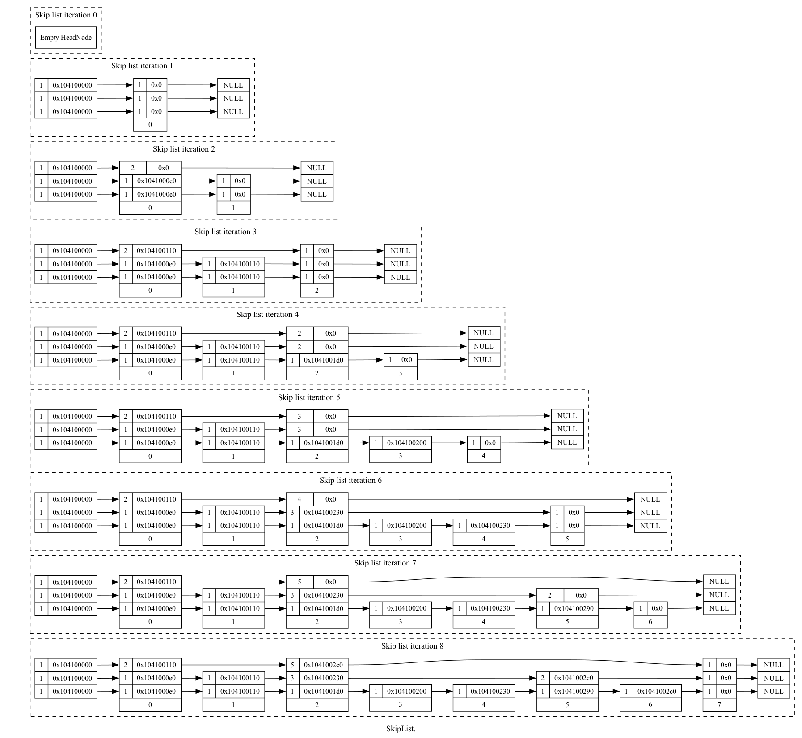
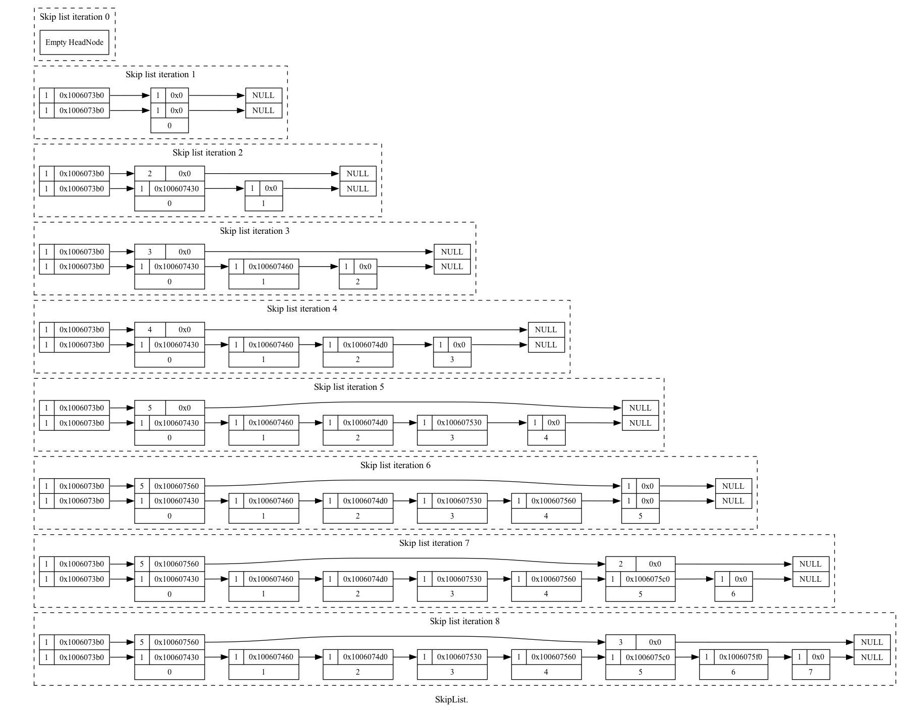
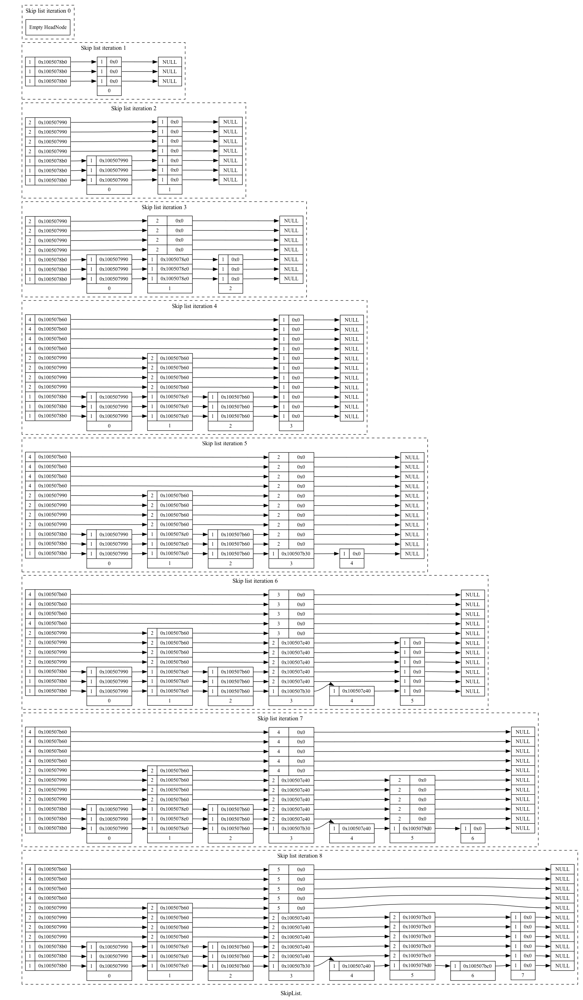

.. highlight:: python
    :linenothreshold: 10

.. highlight:: c
    :linenothreshold: 10

.. toctree::
    :maxdepth: 3

.. _biased-coins-label:

===============================================
Biased Coin Skip List Visualisations
===============================================

-----------------------
Fair coin, ``p(0.5)``
-----------------------

This is the default implementation of the skip list. Each coarser linked list (should) have half the references.

--------------------
1:8, ``p(0.125)``
--------------------

There are very few coarser linked lists here. This is getting closer to a normal linked list with O(n) search behaviour.

--------------------
1:4, ``p(0.25)``
--------------------

--------------------
3:4, ``p(0.75)``
--------------------

Each node now participates in many more linked lists. This may/may not improve search performance but it will certainly increase size requirements.

For the effect of a biased coin on time/space performance see :ref:`performance-biased-coins-label`
