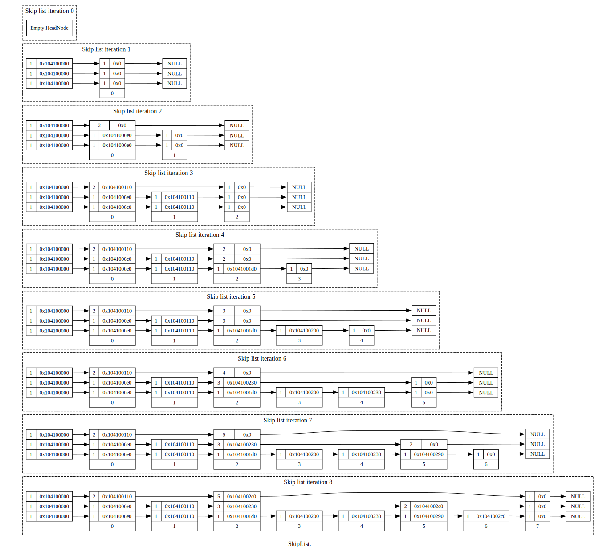

.. highlight:: python
    :linenothreshold: 10

.. highlight:: c
    :linenothreshold: 10

.. toctree::
    :maxdepth: 3

.. _biased-coins-label:

**************************************
The Effect of Using a Biased Coin
**************************************

===============================================
Visualisations
===============================================

--------------------
Fair coin
--------------------

--------------------
1:8
--------------------

--------------------
1:4
--------------------

--------------------
3:4
--------------------

