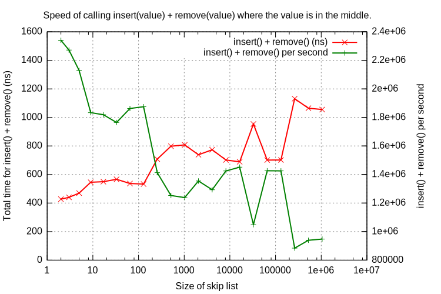
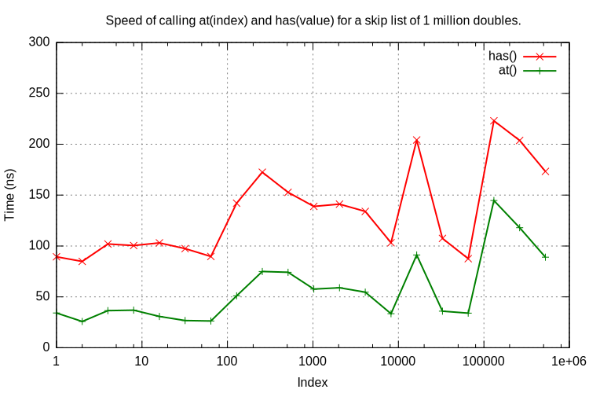
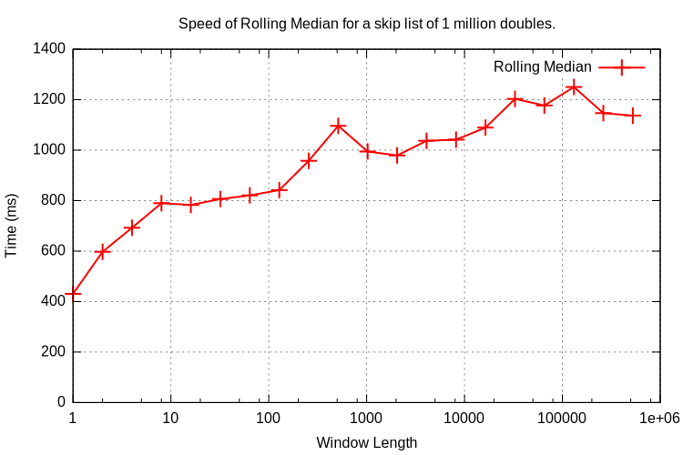
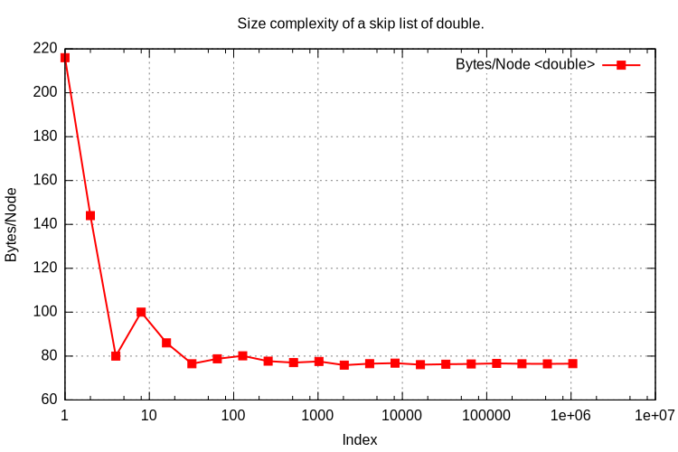
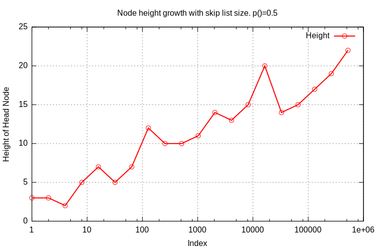
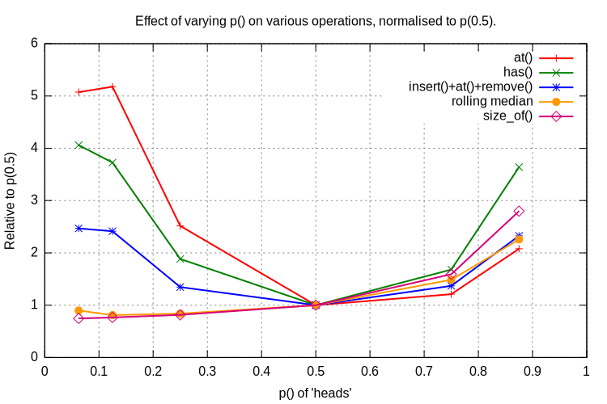
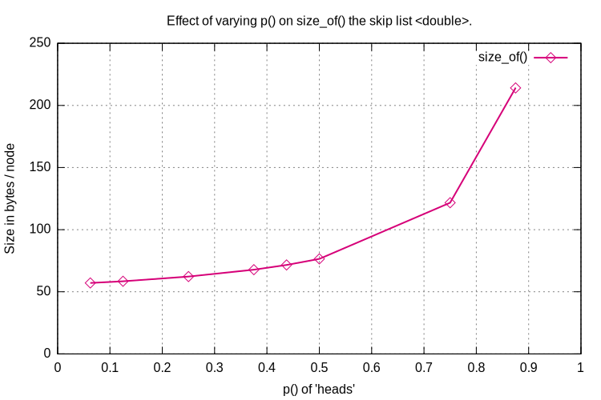

.. highlight:: python
    :linenothreshold: 10

.. highlight:: c
    :linenothreshold: 10

.. _performance-label:

**************************************
Skip List Performance
**************************************

.. toctree::
    :maxdepth: 2

====================================
C++ Performance Tests
====================================

The time performance tests are run as follows:

.. code-block:: sh

    $ cd src/cpp
    $ make release
    $ ./SkipList_R.exe
                     test_very_simple_insert(): PASS
                                                        ...
                     test_roll_med_even_mean(): PASS
                   perf_single_insert_remove(): 451.554 (ms) rate x.xe+06 /s
                                                        ...
                perf_roll_med_odd_index_wins(): vectors length:  1000000 window width: 524288 time: x.x (ms)
                                perf_size_of(): size_of(       1):      216 bytes ratio:      216 /sizeof(T):       x
                                                        ...
    Final result: PASS
    Exec time: x.x (s)
    Bye, bye!

====================================
Time Performance
====================================

The performance test mostly work on a skip list of type ``double`` that has 1 million values. Test on a couple of modern 64 bit OS's [Linux, Mac OS X] show that the cost of skip list operations is typically as follows.

-------------------------------------------------
Mutating operations: ``insert()``, ``remove()``
-------------------------------------------------

These operations depend on the size of the skip list. For one containing 1 million doubles each operation is typically 450 ns (2.2 million operations per second).

Here is a graph showing the cost of the *combined* ``insert()`` plus ``remove()`` of a value in the middle of the list, both as time in (ns) and rate per second.
The test functions ``perf_single_ins_rem_middle_vary_length()``.

This shows good O(log(n)) behaviour where n is the skip list size.

-------------------------------------------------
Indexing operations: ``at()``, ``has()``
-------------------------------------------------

These operations on a skip list containing 1 million doubles is typically 220 ns (4.6 million operations per second).

^^^^^^^^^^^^^^^^^^^^^^^^^^^^^^^^^^^^^^^^^^^^^^^^^^^^^
vs Location
^^^^^^^^^^^^^^^^^^^^^^^^^^^^^^^^^^^^^^^^^^^^^^^^^^^^^

Here is plot of the time taken to execute ``at()`` or ``has()`` on a skip list of 1 million doubles where the X-axis is the position in the skip list of the found double.
The test functions are respectively ``perf_at_in_one_million()`` and ``perf_has_in_one_million()``.

This shows fairly decent O(log(n))'ish type behaviour.

^^^^^^^^^^^^^^^^^^^^^^^^^^^^^^^^^^^
Rolling Median
^^^^^^^^^^^^^^^^^^^^^^^^^^^^^^^^^^^

Here is a plot of the time taken to compute a rolling median on one million values using different window sizes. The number of results is 1e6 - window size. This needs to ``insert(new_value)`` then ``at(middle)`` then ``remove(old_value)``. A window size of 1000 and 1m values (the size of the skip list) takes around 1 second or 1000 ns /value.

The test function is ``perf_roll_med_odd_index_wins()``.

.. _performance-space-complexity-label:

====================================
Space Complexity
====================================

Space usage is a weakness of skip lists. There is a large amount of bookkeeping involved with multiple node pointers plus the width values for each node for an indexed skip list.

-------------------------------------------
Theoretical Memory Usage for ``double``
-------------------------------------------

The space requirements for a skip list of doubles can be estimated as follows.

``t = sizeof(T)`` ~ typ. 8 bytes for a double. ``v = sizeof(std::vector<struct NodeRef<T>>)`` ~ typ. 32 bytes. ``p = sizeof(Node<T>*)`` ~ typ. 8 bytes. ``e = sizeof(struct NodeRef<T>)`` ~ typ. 8 + p = 16 bytes. Then each node: is ``t + v`` bytes.

Linked list at level 0 is ``e`` bytes per node and at level 1 is, typically, ``e / 2`` bytes per node (given ``p()`` as a fair coin) and so on. So the totality of linked lists is about ``2 * e`` bytes per node.

Then the total is ``N (t + v + 2 e)`` which for ``T`` as a double is typically 72 bytes per item.

Memory usage can be gauged by any of the following methods:

* Theoretical calculation such as above which gives ~72 bytes per node for doubles.
* Observing a process that creates a skip list using OS tools, this typically gives ~86 bytes per node for doubles.
* Calling the ``size_of()`` method that can make use of its knowledge of the internal structure of a skip list to estimate memory usage. For ``double`` this is shown to be about 76 bytes per node. Any ``size_of()`` estimate will be an underestimate if the skip list type uses dynamic memory allocation such as ``std::string``.

-------------------------------------------
Estimate Memory Usage With ``size_of()``
-------------------------------------------

This implementation of a skip list has a ``size_of()`` function that estimates the current memory usage of the skip list. This function uses ``sizeof(T)`` which will not account for any dynamically allocated content, for example if ``T`` was a ``std::string``.

Total memory allocation is a function of a number of factors:

* Alignment issues with the members of ``class Node`` which has members ``T _value;`` and ``SwappableNodeRefStack<T> _nodeRefs;``. If ``T`` was a ``char`` type then alignment issues on 64 bit machines may mean the ``char`` takes eight bytes, not one. 
* The size of the skip lists, very small skip lists carry the overhead of the ``HeadNode``.
* The coin probability ``p()``. Unfair coins can change the overhead of the additional coarser linked lists. More about this later.

The following graph shows the ``size_of()`` a skip list of doubles of varying lengths. The Y axis is the ``size_of()`` divided by the length of the skip list in bytes per node. Fairly quickly this settles down to around 80 bytes a node or around 10 times the size of a single double. The test name is ``perf_size_of()``.

---------------------------------------------
Height Distribution
---------------------------------------------

This graph shows the height growth of the skip list where the height is the number of additional coarse linked lists. It should grow in a log(n) fashion and it does. It is not monotonic as this skip list is a probabilistic data structure.

.. _performance-biased-coins-label:

====================================
Effect of a Biased Coin
====================================

The default compilation of the skip list uses a fair coin. The coin toss is determined by ``tossCoin()`` in *SkipList.cpp* which has the following implementation:

.. code-block:: c

    bool tossCoin() {
        return rand() < RAND_MAX / 2;
    }

The following biases can be introduced with these return statements:

=================================== ================================================================
p()                                 Return statement
=================================== ================================================================
6.25%                               ``return rand() < RAND_MAX / 16;``
12.5%                               ``return rand() < RAND_MAX / 8;``
25%                                 ``return rand() < RAND_MAX / 4;``
50%                                 ``return rand() < RAND_MAX / 2;``
75%                                 ``return rand() < RAND_MAX - RAND_MAX / 4;``
87.5%                               ``return rand() < RAND_MAX - RAND_MAX / 8;``
=================================== ================================================================

For visualising what a skip list looks like with a biased coin see :ref:`biased-coins-label`

------------------------------------
Time Performance
------------------------------------

The following graph plots the time cost of ``at(middle)``, ``has(middle_value)``, ``insert(), at(), remove()`` and the rolling median (window size 101) all on a 1 million long skip list of doubles against ``p()`` the probability of the coin toss being heads. The time cost is normalised to ``p(0.5)``.

Reducing ``p()`` reduces the number of coarser linked lists that help speed up the search so it is expected that the performance would deteriorate. If ``p()`` was zero the skip list would be, effectively, a singly linked list with O(n) search performance. I do not understand why the rolling median performance appears to improve slightly when the rolling median is really just an ``insert(), at(), remove()`` operation.

Increasing ``p()`` increases the number of coarser linked lists that might be expected to speed up the search. This does not do so in practice, possible explanations are:

* The increased cost of creating a node
* The increased memory usage (see next section)
* Poor locality of reference of the nodes.

------------------------------------
Space Performance
------------------------------------

Different values of ``p()`` greatly influences the space used as it directly affects the number of coarser linked lists created. In practice a reduction of ``p()`` provides some small space improvement.

If the skip list was highly optimised for rolling median operations it might be worth experimenting with ``p(0.25)`` or even ``p(0.125)`` and evaluate the time/space requirements but otherwise there seems no reason, in the general case, to use anything but ``p(0.5)``.

===============================
Detailed Performance
===============================

The performance test function names all start with ``perf_...`` and are as follows. The skip list type is ``<double>``. In the table below 1M means mega, i.e. 2**20 or 1024*1024 or 1048576:

=================================== =========================================== =========== ========
Test Name                           Measure                                     Time/value  Rate
=================================== =========================================== =========== ========
``perf_single_insert_remove()``     With an empty skip list                     240 ns      4.1 M/s
                                    add one item and remove it.
``perf_large_skiplist_ins_only()``  Starting with an empty skip list append 1   740 ns      1.3 M/s
                                    million values.
``perf_large_skiplist_ins_rem()``   Starting with an empty skip list append 1   900 ns      1.1 M/s
                                    million values then remove the first
                                    (lowest) value until the skip list is
                                    empty.
``perf_single_ins_rem_middle()``    With a skip list of 1 million values insert 1200 ns     0.85 M/s
                                    the middle value (i.e. 500,000.0) and
                                    remove it. 
``perf_single_at_middle()``         With a skip list of 1 million values find   220 ns      4.6 M/s
                                    the middle value.
``perf_single_has_middle()``        With a skip list of 1 million values test   210 ns      4.8 M/s
                                    for the middle value.
``perf_single_ins_at_rem_middle()`` With a skip list of 1 million values call   1400 ns     0.7 M/s
                                    ``insert(v)``, ``at(500000)`` and
                                    ``remove(v)`` where ``v`` corresponds to
                                    the middle value. This simulates the
                                    actions of a rolling median.
``perf_median_sliding_window()``    Simulate a rolling median of 100 values.    800 ns      1.3 M/s
                                    Create an initially empty skip list. For
                                    each of 10,000 random values
                                    insert the value into the skip list. For
                                    indicies > 100 extract the middle value
                                    from the skip list as the median then
                                    remove the i-100 value from the skip list.
``perf_1m_median_values()``         Simulate a rolling median of 101 values.    720 ns      1.4 M/s
                                    Similar to
                                    ``perf_median_sliding_window()`` but uses
                                    1 million values.
``perf_1m_medians_1000_vectors()``  Simulate a rolling median of 101 values.    690 ns      1.4 M/s
                                    Similar to ``perf_1m_median_values()``
                                    but uses 1000 values repeated 1000 times.
``perf_simulate_real_use()``        Simulate a rolling median of 200 values.    760 ns      1.3 M/s
                                    Similar to
                                    ``perf_1m_medians_1000_vectors()`` but
                                    uses 8000 values repeated 8000 times
                                    i.e. the rolling median of 8000x8000
                                    array.
``perf_roll_med_odd_index()``       Tests the time cost of                      830 ns      1.2 M/s
                                    ``ManAHL::RollingMedian::odd_index``
                                    for 1 million values and a window size of
                                    101.
=================================== =========================================== =========== ========

---------------------------------
Time Complexity
---------------------------------

There are a number of tests that check the execution time of operations with varying sizes of skip lists. The expectation is that the time complexity is O(log(n)).

=================================== ================================================================
Test Name                           Description
=================================== ================================================================
``perf_at_in_one_million()``        For 1M values call ``at(i)`` where i ranges from 2**1 to 2**19.
                                    This explores the time complexity of ``at()``.
``perf_has_in_one_million()``       For 1M values call ``has(i)`` where i ranges from 2**1 to 2**19.
                                    This explores the time complexity of ``has()``.
``perf_roll_med_odd_index_wins()``  As ``perf_roll_med_odd_index()`` but explores various window
                                    sizes from 1 to 524288.
=================================== ================================================================
