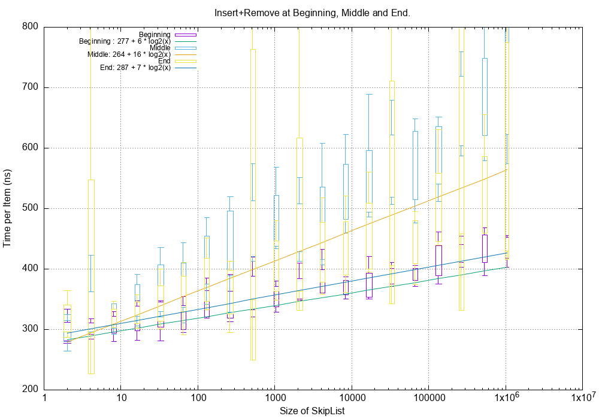
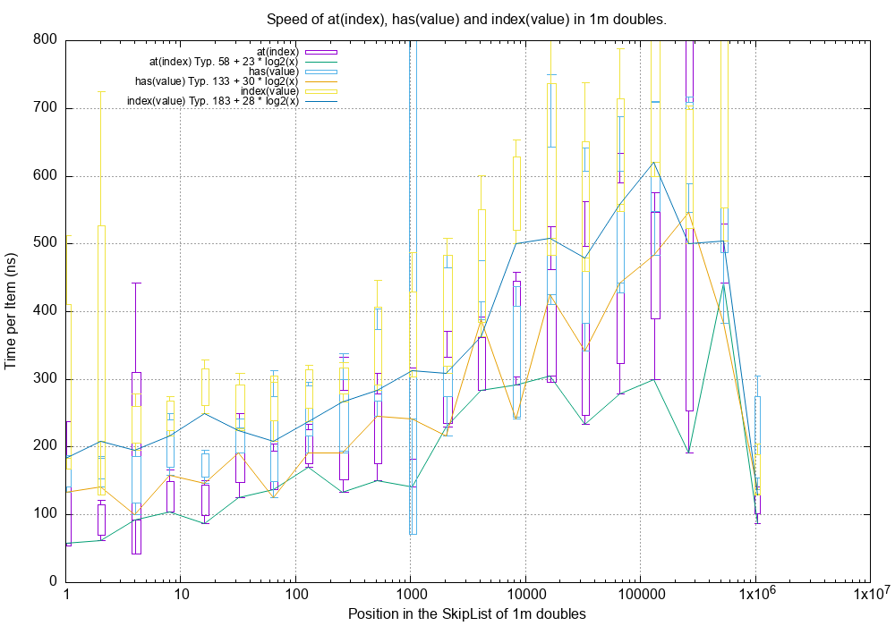
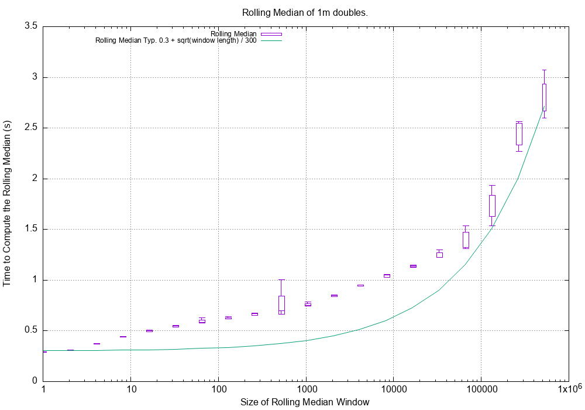
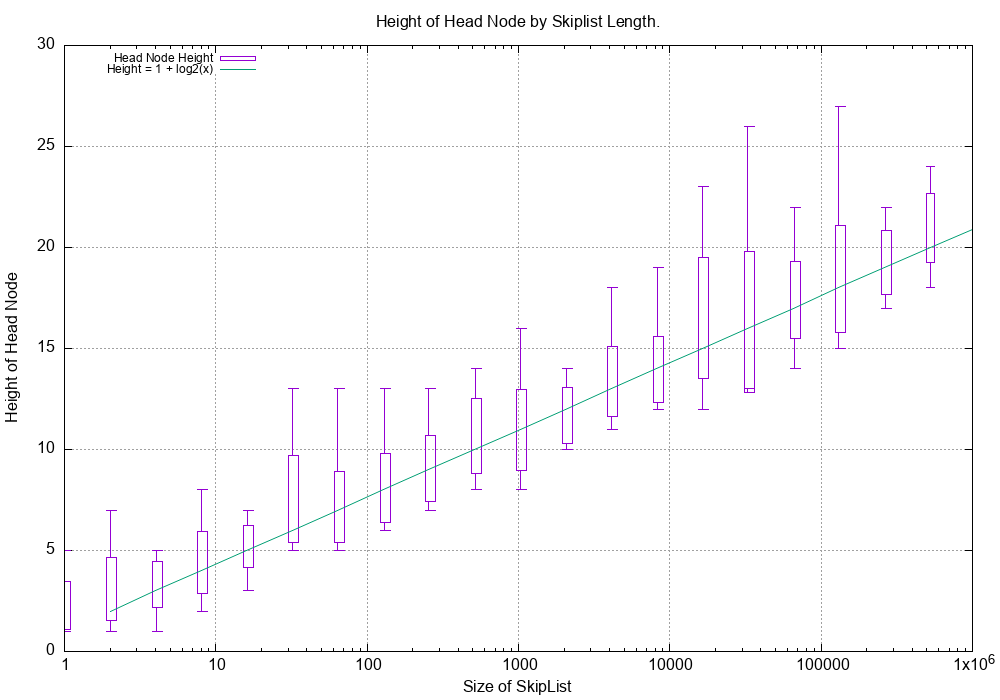
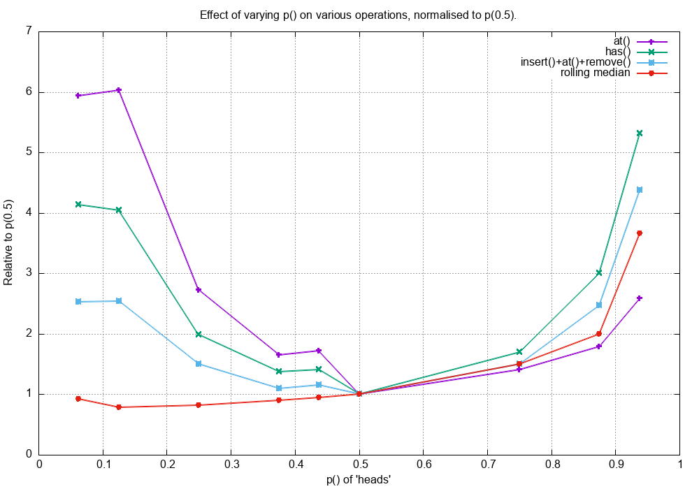
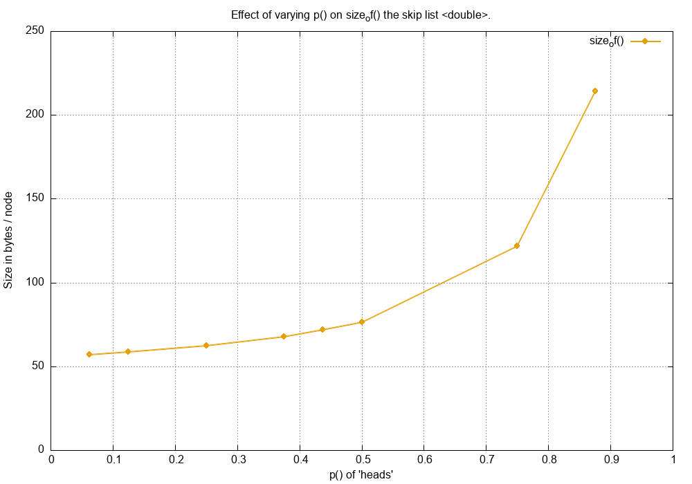
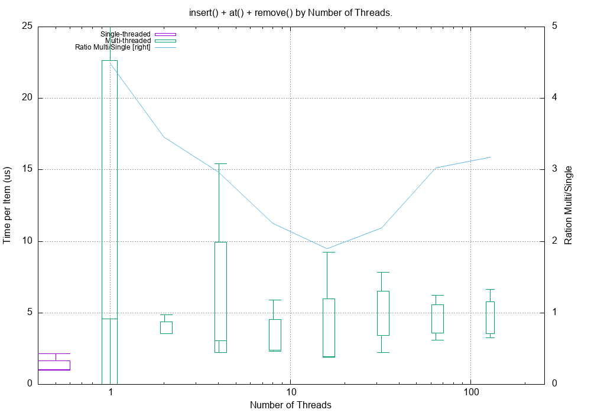

.. highlight:: python
    :linenothreshold: 10

.. highlight:: c
    :linenothreshold: 10

.. _performance-label:

**************************************
Skip List Performance
**************************************

.. toctree::
    :maxdepth: 2

====================================
C++ Performance Tests
====================================

The time performance tests are run as follows:

.. code-block:: sh

    $ cd src/cpp
    $ make release
    $ ./SkipList_R.exe
                     test_very_simple_insert(): PASS
                                                        ...
                     test_roll_med_even_mean(): PASS
                   perf_single_insert_remove(): 451.554 (ms) rate x.xe+06 /s
                                                        ...
                perf_roll_med_odd_index_wins(): vectors length:  1000000 window width: 524288 time: x.x (ms)
                                perf_size_of(): size_of(       1):      216 bytes ratio:      216 /sizeof(T):       x
                                                        ...
    Final result: PASS
    Exec time: x.x (s)
    Bye, bye!

The ouptut is a combination of test results, performance results and dot visualisations

If multi-threaded support is enabled (see :ref:`multi-threaded-performance` below) the execution time including the
multi-threaded tests takes about three minutes. With single threaded support the tests take around two minutes.
If the debug version is built the performance tests are omitted as the cost of integrity checking at every step is very
high which would make the performance test data irrelevant.

====================================
Time Performance
====================================

The performance test mostly work on a SkipList of type ``double`` that has 1 million values.
Test on a couple of modern 64 bit OS's [Linux, Mac OS X] show that the cost of SkipList operations is typically as
follows.

-------------------------------------------------
Mutating operations: ``insert()``, ``remove()``
-------------------------------------------------

These operations depend on the size of the SkipList. For one containing 1 million doubles each operation is typically
450 ns (2.2 million operations per second).

Here is a graph showing the cost of the *combined* ``insert()`` plus ``remove()`` of a value in different places in the
list of 1m doubles.
The candlesticks are calculated thus:

- The lowest point is the minimum value of several repeats (typically 10).
  This is the mose relevant time as it represents the time free of CPU contention.
- The lowest box value is the mean value *minus* the standard deviation of several repeats (typically 10).
- The lowest box value is the mean value *plus* the standard deviation of several repeats (typically 10).
- The highest point is the maximum value of several repeats (typically 10).

The test functions are in ``src/cpp/test/test_performance.cpp``:

- ``perf_test_double_insert_remove_value_begin()`` inserts and removes a value from the beginning of the list.
- ``perf_test_double_insert_remove_value_mid()`` inserts and removes a value from the middle of the list.
- ``perf_test_double_insert_remove_value_end()`` inserts and removes a value from the end of the list.

..
    :width: 640

The lines on the graph depict the minimum values of several test repeats.
This shows good O(log(n)) behaviour where n is the SkipList size.
As expected inserting and removing in the middle is more costly because of the more complicated search setup.

-----------------------------------------------------------
Indexing operations: ``at()``, ``has()`` ``index()``
-----------------------------------------------------------

These operations on a SkipList containing 1 million doubles is typically 220 ns (4.6 million operations per second).

^^^^^^^^^^^^^^^^^^^^^^^^^^^^^^^^^^^^^^^^^^^^^^^^^^^^^
vs Location
^^^^^^^^^^^^^^^^^^^^^^^^^^^^^^^^^^^^^^^^^^^^^^^^^^^^^

Here is plot of the time taken to execute ``at(index)``, ``has(value)`` and ``index(value)`` on a SkipList of 1 million
doubles where the X-axis is the position in the SkipList of the found double.

The test functions are in ``src/cpp/test/test_performance.cpp``:

- ``perf_test_double_at_1m_all()``.
- ``perf_test_double_has_1m_all()``.
- ``perf_test_double_index_1m_all()``.

The lines show the minimum values and the legend shows the log(n) behaviour.

This shows good O(log(n))'ish type behaviour.

^^^^^^^^^^^^^^^^^^^^^^^^^^^^^^^^^^^
Rolling Median
^^^^^^^^^^^^^^^^^^^^^^^^^^^^^^^^^^^

Here is a plot of the time taken to compute a rolling median on one million values using different window sizes.
The number of results is 1e6 - window size.
This needs to ``insert(new_value)`` then ``at(middle)`` then ``remove(old_value)``.
A window size of 1000 and 1m values (the size of the SkipList) takes around 0.75 second or 750 ns /value.
The line shows a very approximate fir to the minimum recorded value of around 0.3 + sqrt(window length) / 300 seconds.

The test function is ``perf_roll_med_by_win_size()`` in ``src/cpp/test/test_performance.cpp``.

.. _performance-space-complexity-label:

====================================
Space Complexity
====================================

Space usage is a weakness of SkipLists.
There is a large amount of bookkeeping involved with multiple node pointers plus the width values for each node for an
indexed SkipList.

-------------------------------------------
Theoretical Memory Usage for ``double``
-------------------------------------------

The space requirements for a SkipList of doubles can be estimated as follows.

- ``t = sizeof(T)`` ~ typ. 8 bytes for a double.
- ``v = sizeof(std::vector<struct NodeRef<T>>)`` ~ typ. 32 bytes.
- ``p = sizeof(Node<T>*)`` ~ typ. 8 bytes.
- ``e = sizeof(struct NodeRef<T>)`` ~ typ. 8 + p = 16 bytes.

Then each node: is ``t + v`` bytes.

Linked list at level 0 is ``e`` bytes per node and at level 1 is, typically, ``e / 2`` bytes per node
(given ``p()`` as a fair coin) and so on.
So the totality of linked lists is about ``2 * e`` bytes per node.

Then the total is ``N (t + v + 2 e)`` which for ``T`` as a double is typically 72 bytes per item.

Memory usage can be gauged by any of the following methods:

* Theoretical calculation such as above which gives ~72 bytes per node for doubles.
* Observing a process that creates a SkipList using OS tools, this typically gives ~86 bytes per node for doubles.
* Calling the ``size_of()`` method that can make use of its knowledge of the internal structure of a SkipList to
  estimate memory usage.
  For ``double`` this is shown to be about 76 bytes per node.
  Any ``size_of()`` estimate will be an underestimate if the SkipList ``<T>`` uses dynamic memory allocation such as
  ``std::string``.

-------------------------------------------
Estimate Memory Usage With ``size_of()``
-------------------------------------------

This implementation of a SkipList has a ``size_of()`` function that estimates the current memory usage of the SkipList.
This function uses ``sizeof(T)`` which will not account for any dynamically allocated content, for example if ``T`` was
a ``std::string``.

Total memory allocation is a function of a number of factors:

* Alignment issues with the members of ``class Node`` which has members ``T _value;`` and
  ``SwappableNodeRefStack<T> _nodeRefs;``. If ``T`` was a ``char`` type then alignment issues on 64 bit machines may
  mean the ``char`` takes eight bytes, not one.
* The size of the SkipLists, very small SkipLists carry the overhead of the ``HeadNode``.
* The coin probability ``p()``. Unfair coins can change the overhead of the additional coarser linked lists.
  More about this later.

The following graph shows the ``size_of()`` a SkipList of doubles of varying lengths with a fair coin.
The Y axis is the ``size_of()`` divided by the length of the SkipList in bytes per node.
Fairly quickly this settles down to around 80 bytes a node or around 10 times the size of a single double.
The test name is ``perf_size_of()``.

---------------------------------------------
Height Distribution
---------------------------------------------

This graph shows the height growth of the SkipList where the height is the number of additional coarse linked lists.
It should grow in a log(n) fashion and it does.
The tests is ``perf_test_node_height_growth()`` in ``src/cpp/test/test_performance.cpp``.

.. _performance-biased-coins-label:

====================================
Effect of a Biased Coin
====================================

The default compilation of the SkipList uses a fair coin.
The coin toss is determined by ``tossCoin()`` in *SkipList.cpp* which has the following implementation:

.. code-block:: c

    bool tossCoin() {
        return rand() < RAND_MAX / 2;
    }

The following biases can be introduced with these return statements:

=================================== ================================================================
p()                                 Return statement
=================================== ================================================================
6.25%                               ``return rand() < RAND_MAX / 16;``
12.5%                               ``return rand() < RAND_MAX / 8;``
25%                                 ``return rand() < RAND_MAX / 4;``
50%                                 ``return rand() < RAND_MAX / 2;``
75%                                 ``return rand() < RAND_MAX - RAND_MAX / 4;``
87.5%                               ``return rand() < RAND_MAX - RAND_MAX / 8;``
=================================== ================================================================

For visualising what a SkipList looks like with a biased coin see :ref:`biased-coins-label`

------------------------------------
Time Performance
------------------------------------

The following graph plots the time cost of ``at(middle)``, ``has(middle_value)``, ``insert(), at(), remove()`` and the
rolling median (window size 101) all on a 1 million long SkipList of doubles against ``p()`` the probability of the
coin toss being heads. The time cost is normalised to ``p(0.5)``.

Reducing ``p()`` reduces the number of coarser linked lists that help speed up the search so it is expected that the
performance would deteriorate.
If ``p()`` was zero the SkipList would be, effectively, a singly linked list with O(n) search performance.
I do not understand why the rolling median performance appears to improve slightly when the rolling median is really
just an ``insert(), at(), remove()`` operation.

Increasing ``p()`` increases the number of coarser linked lists that might be expected to speed up the search.
This does not do so in practice, possible explanations are:

* The increased cost of creating a node
* The increased memory usage (see next section)
* Poor locality of reference of the nodes.

------------------------------------
Space Performance
------------------------------------

Different values of ``p()`` greatly influences the space used as it directly affects the number of coarser linked lists
created.
In practice a reduction of ``p()`` provides some small space improvement.

If the SkipList was highly optimised for rolling median operations it might be worth experimenting with ``p(0.25)``
or even ``p(0.125)`` and evaluate the time/space requirements but otherwise there seems no reason, in the general case,
to use anything but ``p(0.5)``.

.. _multi-threaded-performance:

===============================
Multi-threaded C++ Performance
===============================

The C++ code is capable of multi-threading support where a single SkipList can be mutated by multiple threads.
The code must be compiled with the macro ``SKIPLIST_THREAD_SUPPORT`` defined.

Test C++ execution code can be run by invoking the the makefile thus:

.. code-block:: console

    $ cd src/cpp
    $ make release CXXFLAGS=-DSKIPLIST_THREAD_SUPPORT
    $ ./SkipList_R.exe
                   ...
                   test_single_thread_insert(): PASS
           test_two_thread_insert_has_remove(): PASS
          test_two_thread_insert_count_has_remove_count(): PASS
         test_perf_insert_count_has_remove_count_multi_threads_vary_length(): threads:    1 SkiplistSize:   131072 time:       180145 (us) rate       727592 /s
                                                ...
        test_perf_single_thread_fixed_length(): PASS
    
    Final result: PASS
    Exec time: x.x (s)
    Bye, bye!

.. NOTE::
    If you omit ``CXXFLAGS=-DSKIPLIST_THREAD_SUPPORT`` then the threaded tests will be omitted:
        
    .. code-block:: console
    
        $ make release
        $ ./SkipList_R.exe
                       ...
                       test_single_thread_insert(): N/A
               test_two_thread_insert_has_remove(): N/A
              test_two_thread_insert_count_has_remove_count(): N/A
                

----------------------------------------------------------------
Effect of ``SKIPLIST_THREAD_SUPPORT``
----------------------------------------------------------------

Here are several performance measurements when ``SKIPLIST_THREAD_SUPPORT`` is defined:

* A SkipList in a single threaded environment.
* A SkipList in a multi threaded environment where threads vie for the same SkipList.

To explore this we create a task that is to insert a unique double into an empty SkipList 2**14 (16384) times and then
remove that number one by one to empty the SkipList. This task typically takes 18 ms (around 1 us per insert+remove).

This task will be repeated 1, 2, 4, ... 64 times using single and multiple threads.
The single threaded version is sequential, the multithreaded version creates simultaneous operations on the same
SkipList.

The code for these tests is in ``test/test_concurrent.cpp``.

^^^^^^^^^^^^^^^^^^^^^^^^^^^^^^
A Single Threaded Environment
^^^^^^^^^^^^^^^^^^^^^^^^^^^^^^

The sheer act of using ``-DSKIPLIST_THREAD_SUPPORT`` will introduce a mutex into the head node.
This will increase the time of any operation on the SkipList even when run in the single thread as there is a cost of
acquiring the mutex even in the absence of contention. The test function is ``test_perf_single_thread_fixed_length()``.

In the graph below the X axis is the number of times the task is repeated (sequentially).
The left Y axis is the total execution time with the SkipList in the main thread.
The right Y axis is the ratio: time with ``-DSKIPLIST_THREAD_SUPPORT`` / time without ``-DSKIPLIST_THREAD_SUPPORT``

.. image::
    plots/images/perf_cpp_threaded_vs_single.png

The overhead of using ``-DSKIPLIST_THREAD_SUPPORT`` is about 0% to 15%.

^^^^^^^^^^^^^^^^^^^^^^^^^^^^^^
A Multi Threaded Environment
^^^^^^^^^^^^^^^^^^^^^^^^^^^^^^

Here is a multi-threaded simulation of the operations typical of rolling median on a shared Skip List.
Each thread:

- Inserts a value at the mid-point of the same Skip List using ``insert()``.
- Checks it has that value using ``has()``.
- Removes that value using ``remove()``

Each of these operations obtains a lock on the Skip List.

Then repeating the task in 1, 2, 4, ... 128 new threads simultaneously where they share the same Skip List.
The test function is ``_test_perf_sim_rolling_median_multi_thread()``.

In the graph below the Y-axis shows the cost for each insert/has/remove operation in microseconds against the number of
threads contending for the SkipList, also shown is the same for a single threaded version (arbitrarily at 0.5 threads).

====================================
Python Performance Tests
====================================

Some informal testing of the Python wrapper around the C++ SkipList was done using
``timeit`` in *tests/perf/test_perf_cSkipList.py*.
The SkipList has 1m items. The performance is comparable to the C++ tests.

======================================= =========================== ==============================
Test                                    Time per operation (ns)     Factor over C++ time
======================================= =========================== ==============================
``test_at_integer()``                   217
``test_at_float()``                     242                         x2.7
``test_has_integer()``                  234
``test_has_float()``                    238                         x1.4
``test_insert_remove_mid_integer()``    1312
``test_insert_remove_mid_float()``      1497                        x1.4
``test_index_mid_int()``                400
``test_index_mid_float()``              356                         x1.9
======================================= =========================== ==============================

It is rather surprising, and satisfying, that the Python overhead is so small considering the boxing/unboxing that is
going on.
The test methodology is different in the Python/C++ cases which might skew the figures.
