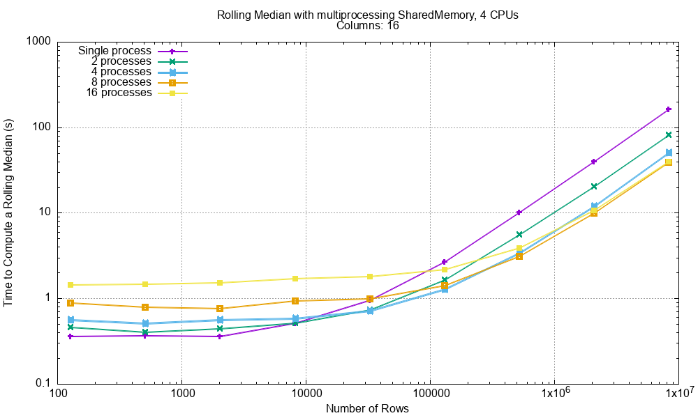
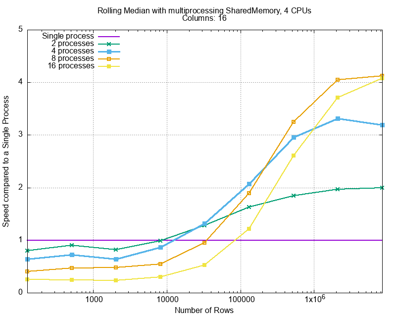
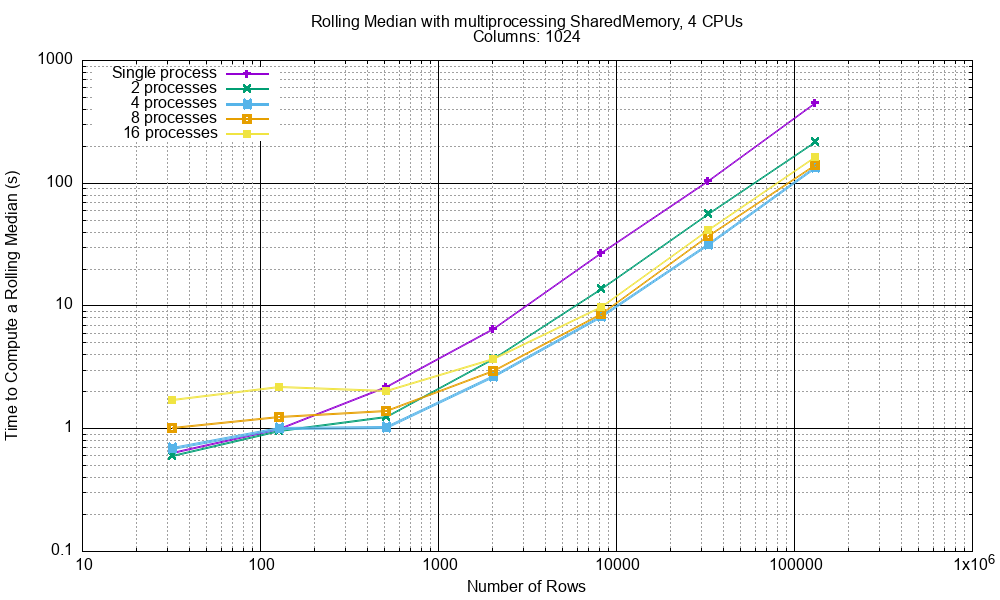
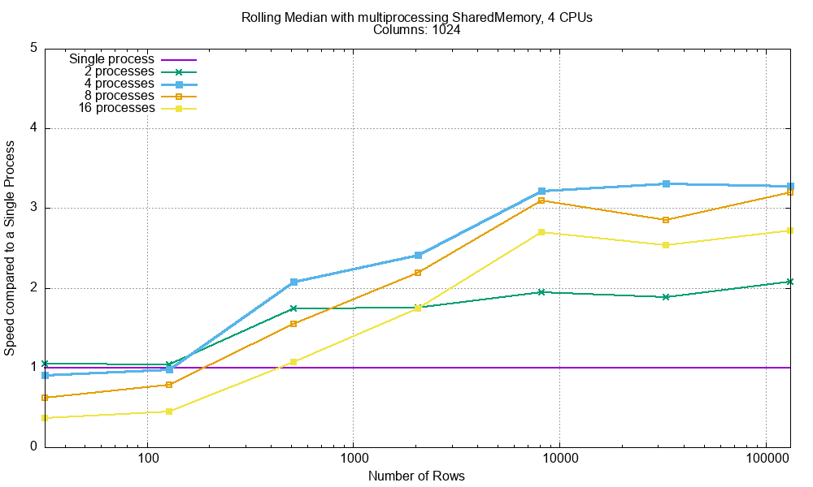
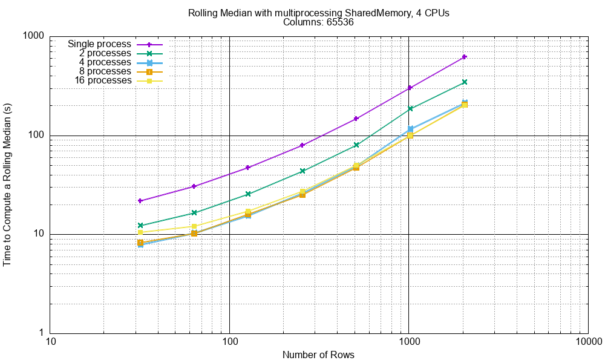
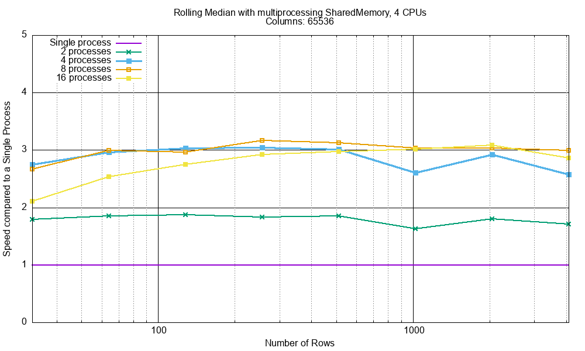

.. highlight:: python
    :linenothreshold: 10

.. highlight:: c
    :linenothreshold: 10

.. toctree::
    :maxdepth: 2

.. _skiplist-rolling-median-label:

===============================================
Computing a Rolling Median
===============================================

-----------------------------------------
Rolling Median in C++
-----------------------------------------

A powerful use case for a skip list is in the computation of a rolling fraction, for example a rolling median.

Here is a reasonable C++ attempt at doing that with the arguments:

* ``data`` - A vector of data of type ``T`` of length ``L``.
* ``win_length`` - a 'window' size. The median is computed over this number of values.
* ``result`` - a destination vector for the result.
  This will either end up with ``L - win_length`` values, alternatively is will be ``L`` long and start with
  ``win_length`` ``NaN`` s.

Rolling median code using a skip list might look like this, error checking is omitted:

.. code-block:: cpp

    #include "SkipList.h"
    
    template <typename T>
    void rolling_median(const std::vector<T> data,
                        size_t win_length,
                        std::vector<T> &result) {
        
        OrderedStructs::SkipList::HeadNode<T> sl;

        result.clear();
        for (size_t i = 0; i < data.size(); ++i) {
            sl.insert(data[i]);
            if (i  >= win_length) {
                result.push_back(sl.at(win_length / 2));
                sl.remove(data[i - win_length]);
            }
        }
    }

If you are working with C arrays (such as Numpy arrays) then this C'ish approach might be better, again error
checking omitted:

.. code-block:: c

    #include "SkipList.h"
    
    template <typename T>
    void rolling_median(const T *src, size_t count, size_t win_length, T *dest) {
        
        OrderedStructs::SkipList::HeadNode<T> sl;
        const T *tail = src;

        for (size_t i = 0; i < count; ++i) {
            sl.insert(*src);
            if (i + 1 >= win_length) {
                *dest = sl.at(win_length / 2);
                ++dest;
                sl.remove(*tail);
                ++tail;
            }
            ++src;
        }
    }

Multidimensional Numpy arrays have a stride value which is omitted in the above code but is simple to add.
See *RollingMedian.h* and *test/test_rolling_median.cpp* for further examples.

Rolling percentiles require a argument that says what fraction of the window the required value lies.
Again, this is easy to add.

Even Window Length
-----------------------------------------

The above code assumes that if the window length is even that the median is at ``(window length - 1) / 2``.
A more plausible median for even sized window lengths is the mean of ``(window length - 1) / 2`` and
``window length / 2``. This requires that the mean of two types is meaningful which it will not be for strings.

-----------------------------------------
Rolling Median in Python
----------------------------------------

Here is an example of computing a rolling median of a ``numpy`` 1D array.
This creates an array with the same length as the input starting with ``window_length`` ``NaN`` s:

.. code-block:: python

    import numpy as np

    import orderedstructs

    def simple_python_rolling_median(vector: np.ndarray,
                                     window_length: int) -> np.ndarray:
        """Computes a rolling median of a numpy vector returning a new numpy
        vector of the same length.
        NaNs in the input are not handled but a ValueError will be raised."""
        if vector.ndim != 1:
            raise ValueError(
                f'vector must be one dimensional not shape {vector.shape}'
            )
        skip_list = orderedstructs.SkipList(float)
        ret = np.empty_like(vector)
        for i in range(len(vector)):
            value = vector[i]
            skip_list.insert(value)
            if i >= window_length - 1:
                # // 4 for lower quartile
                # * 3 // 4 for upper quartile etc.
                median = skip_list.at(window_length // 2)
                skip_list.remove(vector[i - window_length + 1])
            else:
                median = np.nan
            ret[i] = median
        return ret

This can be called thus:

.. code-block:: python

    np_array = np.arange(10.0)
    print('Original:', np_array)
    result = simple_python_rolling_median(np_array, 3)
    print('  Result:', result)

And the result will be:

.. code-block:: text

    Original: [0. 1. 2. 3. 4. 5. 6. 7. 8. 9.]
      Result: [nan nan  1.  2.  3.  4.  5.  6.  7.  8.]

Of course this Python code could be made much faster by using a Python C Extension.

.. _rolling-median-mp-shared-memory-label:

----------------------------------------------------------------
Rolling Median in Python with ``multiprocessing.shared_memory``
----------------------------------------------------------------

An exiting development in Python 3.8+ is
`multiprocessing.shared_memory <https://docs.python.org/3/library/multiprocessing.shared_memory.html#module-multiprocessing.shared_memory>`_
This allows a parent process to share memory with its child processes.

In this example we are going to compute a rolling median on a 2D numpy array where each child process works on a single
column of the same array and writes the result to a shared output array.
There will be two shared memory areas; a read one with the input data and a write one with the result from all the
child processes
There will be two corresponding numpy arrays the input that we are given and the output numpy array that we create.

The only copying going on here is the initial copy of the input array into shared memory and then the final copy, when
all child processes have completed of *that* shared memory to a single numpy array.

Pictorially:

.. code-block:: text

    Parent                                        Children
    ======                                        ========
    Copies the numpy array to the input SharedMemory
    Creates the output SharedMemory
    Launches n child processes...
    \>>>>>>>>>>>>>>>>>>>>>>>>>>>>>>>>>>>>>>>>>>>>\
                                                  Work on part of the input SharedMemory
                                                  Write to the output SharedMemory
                                                  ...
    /<<<<<<<<<<<<<<<<<<<<<<<<<<<<<<<<<<<<<<<<<<<</
    When all child processes complete...
    Copies output SharedMemory to a new numpy array
    Releases both SharedMemory resources.

.. note::

    This solution assumes that you are given a numpy array that you need to process.
    An alternative solution is to create a shared memory object, create an empty numpy array that uses the shared
    memory buffer, populate that buffer and pass the buffer to the child processes.
    This would save the cost, in time and memory, of the first copy operation.

Code
-----------------------------------------

These are the essential imports:

.. code-block:: python

    import multiprocessing
    # Python 3.8+, need to be specific about importing this.
    from multiprocessing import shared_memory
    import typing

    import numpy as np

    import orderedstructs

Firstly, as a reminder here is our rolling median function that will be used by the child processes, it works on a
specific column of a numpy array:

.. code-block:: python

    def rolling_median_of_column(read_array: np.ndarray, window_length: int,
                                 column_index: int,
                                 write_array: np.ndarray) -> int:
        """Computes a rolling median of given column and writes out the results to
        the write array.
        Called by a child process."""
        assert read_array.ndim == 2
        assert write_array.ndim == 2
        assert read_array.shape == write_array.shape
        skip_list = orderedstructs.SkipList(float)
        write_count = 0
        for i in range(len(read_array)):
            value = read_array[i, column_index]
            skip_list.insert(value)
            if i >= window_length:
                median = skip_list.at(window_length // 2)
                skip_list.remove(read_array[i - window_length, column_index])
                write_count += 1
            else:
                median = np.nan
            write_array[i, column_index] = median
        return write_count

Then let's write some code that wraps the low level ``shared_memory.SharedMemory`` class that can be
used by the parent process.
This is a ``NamedTuple`` that records essential information about the array and includes the ``SharedMemory`` object
itself.
We will call it an ``SharedMemoryArraySpecification``, it is pretty simple, just a named tuple:

.. code-block:: python

    class SharedMemoryArraySpecification(typing.NamedTuple):
        shape: typing.Tuple[int, ...]
        dtype: np.dtype
        nbytes: int
        shm: shared_memory.SharedMemory

        @property
        def name(self) -> str:
            return self.shm.name

        def __str__(self):
            return (
                f'<SharedMemoryArraySpecification shape {self.shape}'
                f' dtype {self.dtype} name "{self.name}"'
                f' nbytes {self.nbytes} buffer id 0x{id(self.shm)}>'
            )

        def close(self) -> None:
            self.shm.close()

        def close_and_unlink(self) -> None:
            self.close()
            self.shm.unlink()

Now create a function that takes a numpy array, copies it into the input ``shared_memory.SharedMemory``.
This returns an ``SharedMemoryArraySpecification``.
We write this as a context manager:

.. code-block:: python

    @contextlib.contextmanager
    def create_read_shared_memory_array_spec_close_unlink(
            arr: np.ndarray
        ) -> SharedMemoryArraySpecification:
        """Context manager that creates a Shared Memory instance and copies the
        numpy array into it.
        The Shared Memory instance is closed and unlinked on exit."""
        shm = shared_memory.SharedMemory(create=True, size=arr.nbytes)
        array_spec = SharedMemoryArraySpecification(
            arr.shape, arr.dtype, arr.nbytes, shm
        )
        logger.info('Created shared memory %s ', array_spec)
        try:
            # Copy the numpy array into shared memory.
            array_view = np.ndarray(
                array_spec.shape, dtype=array_spec.dtype, buffer=array_spec.shm.buf
            )
            array_view[:] = arr[:]
            yield array_spec
        finally:
            array_spec.close_and_unlink()

And another context manager that creates the output ``shared_memory.SharedMemory``:

.. code-block:: python

    @contextlib.contextmanager
    def create_write_shared_memory_array_spec_close_unlink(
            arr: np.ndarray
        ) -> SharedMemoryArraySpecification:
        """Context manager that creates a Shared Memory instance for writing
        to a numpy array.
        The numpy array can be recovered with copy_shared_memory_into_new_numpy_array().
        The Shared Memory instance is closed and unlinked on exit."""
        shm = shared_memory.SharedMemory(create=True, size=arr.nbytes)
        array_spec = SharedMemoryArraySpecification(
            arr.shape, arr.dtype, arr.nbytes, shm
        )
        logger.info('Created shared memory %s ', array_spec)
        try:
            yield array_spec
        finally:
            array_spec.close_and_unlink()

Now create a context manager that will wrap a numpy array around a ``SharedMemoryArraySpecification``
On exit this automatically releases the reference to the shared memory from the child process.

.. code-block:: python

    @contextlib.contextmanager
    def recover_array_from_shared_memory_and_close(
            array_spec: SharedMemoryArraySpecification
        ) -> np.ndarray:
        array_shm = shared_memory.SharedMemory(name=array_spec.name)
        array_view = np.ndarray(array_spec.shape, array_spec.dtype, buffer=array_shm.buf)
        try:
            yield array_view
        finally:
            array_shm.close()

And use it in the child process, once for reading and once for writing:

.. code-block:: python

    def compute_rolling_median_2d_from_index(
            read_array_spec: SharedMemoryArraySpecification,
            window_length: int, column_index: int,
            write_array_spec: SharedMemoryArraySpecification) -> int:
        """Computes a rolling median of the 2D read array and window length
        and writes it to the 2D write array.
        This is invoked by a child process."""
        with recover_array_from_shared_memory_and_close(read_array_spec) as read_array:
            with recover_array_from_shared_memory_and_close(write_array_spec) \
                    as write_array:
                write_count = rolling_median_of_column(
                    read_array, window_length, column_index, write_array
                )
                return write_count

Finally a function to copy the output shared memory to a new numpy array:

.. code-block:: python

    def copy_shared_memory_into_new_numpy_array(
            write_array_spec: SharedMemoryArraySpecification
        ) -> np.ndarray:
        """With the output SharedMemoryArraySpecification this creates a new
        numpy array and copies the shared memory into it."""
        temp_write = np.ndarray(
            write_array_spec.shape,
            dtype=write_array_spec.dtype,
            buffer=write_array_spec.shm.buf
        )
        write_array = np.empty(
            write_array_spec.shape, dtype=write_array_spec.dtype
        )
        write_array[:] = temp_write[:]
        return write_array

Finally here is the code for the parent process that puts this all together:

.. code-block:: python

    def compute_rolling_median_2d_mp(
            read_array: np.ndarray, window_length: int, num_processes: int
        ) -> np.ndarray:
        """Compute a rolling median of a numpy 2D array using multiprocessing
        and shared memory.
        This is run as the parent process."""
        if read_array.ndim != 2:
            raise ValueError(f'Array  must be 2D not {read_array.shape}')
        # Limit number of processes if the number of columns is small.
        if read_array.shape[1] < num_processes:
            num_processes = read_array.shape[1]
        # Create the read and write shared memory context managers
        with create_read_shared_memory_array_spec_close_unlink(read_array) \
                as read_array_spec:
            with create_write_shared_memory_array_spec_close_unlink(read_array) \
                    as write_array_spec:
                # Set up the multiprocessing pool.
                mp_pool = multiprocessing.Pool(processes=num_processes)
                tasks = []
                for column_index in range(read_array.shape[1]):
                    tasks.append(
                        (
                            read_array_spec,
                            window_length,
                            column_index,
                            write_array_spec,
                        )
                    )
                # Run compute_rolling_median_2d_from_index() on the pool
                pool_apply = [
                    mp_pool.apply_async(compute_rolling_median_2d_from_index, t) \
                        for t in tasks
                ]
                results = [r.get() for r in pool_apply]
                # Extract the result as a numpy array.
                write_array = copy_shared_memory_into_new_numpy_array(write_array_spec)
        return write_array

This is function that we are going to time so it includes:

- Copying the numpy array to shared memory.
- Creating the output shared memory.
- Computing the rolling median with child processes.
- Copying the output shared memory to a new numpy array.
- Disposing of any temporaries.

Performance
-----------------------------------------

Mac OS X with 4 cores and hyper-threading.
The table has 16m entries organised with different (column, row) shapes: 16 x 1m, 1k x 128k, 64k x 4k.
The rolling median window is 21.

Columns: 16
^^^^^^^^^^^^

In this test a 16 column array is created with up to 8,388,608 rows.
This is up to 134,217,728 entries at 8 bytes a float this is 1,073,741,824 bytes (1GB) in total.
Running this on 16 column arrays with 1m rows with processes from 1 to 16 gives the following execution times.

Comparing the **speed** of execution compared to a single process gives:

Clearly there is some overhead so it is not really worth doing this for less that 10,000 rows.
The number of processes equal to the number of CPUs is optimum, twice that *might* give a *small* advantage.

Columns: 1024
^^^^^^^^^^^^^^

In this test a 1024 column array is created with up to 131,072 rows.
This is up to 134,217,728 entries at 8 bytes a float this is 1,073,741,824 bytes (1GB) in total.
Running this on 1024 column arrays with up to 131,072 rows with processes from 1 to 16 gives the following execution times.

Comparing the **speed** of execution compared to a single process gives:

Clearly there is some overhead so it is not really worth doing this for less that 1,000 rows or so.

Columns: 65536
^^^^^^^^^^^^^^

In this test a 65,536 column array is created with up to 4096 rows.
This is up to 268,435,456 entries at 8 bytes a float this is 2,147,483,648 bytes (2GB) in total.
Running this on 65,536 column arrays with up to 4096 rows with processes from 1 to 16 gives the following execution times.

Comparing the **speed** of execution compared to a single process gives:

The overhead, by number of columns is very low.

Summary
^^^^^^^^^^^^

For different table shapes using four simultaneous processes on a four CPU machine.
The second column shows the number of rows need to get a 3x performance on a four CPU machine.
The third column ("Best") shows the maximum speedup.

.. list-table:: Performance Gain
   :widths: 20 20 20 50
   :header-rows: 1

   * - Columns
     - ~Rows for 3x
     - Best
     - Notes
   * - 16
     - 800,000
     - 3.3x
     -
   * - 1024
     - 8,000
     - 3.3x
     -
   * - 65536
     - 128
     - 3.0x
     -

Memory Usage
-----------------------------------------

What I would expect in processing a 100Mb numpy array.
Values are in Mb.

.. list-table:: Expected ``shared_memory`` Memory Usage With 100 Mb numpy array
    :widths: 50 30 30
    :header-rows: 1

    * - Action
      - Memory Delta (Mb)
      - Total Memory (Mb)
    * - Create a 'read' numpy array.
      - +100
      - 100
    * - Create  a 'read' shared memory object.
      - +100
      - 200
    * - Copy the 'read' array into 'read' shared memory.
      - 0 or very small.
      - 200
    * - Create  a 'write' shared memory object.
      - +100
      - 300
    * - Calculate the rolling median and write into the 'write' shared memory object.
      - 0 or very small.
      - 300
    * - Create an empty 'write' numpy array.
      - +100
      - 400
    * - Copy the 'write' shared memory into the 'write' numpy array.
      - 0 or very small.
      - 400
    * - Unlink the 'read' shared memory
      - -100
      - 300
    * - Unlink the 'write' shared memory.
      - -100
      - 200
    * - Delete the 'read' numpy array when de-referenced.
      - -100
      - 100
    * - Delete the 'write' numpy array when de-referenced.
      - -100
      - Nominal.

Here are the actual results running on Mac OS X.
Two things are noticeable:

* Creating the shared memory object has no memory cost. It is only when data is copied into it that the memory is
  allocated and that is incremental.
* The RSS shown here is collected from ``psutil`` and it looks like this is including shared memory so there may be
  double counting here. ``psutil`` can not identify shared memory on Mac OS X, it can on Linux.

Here is the breakdown of the RSS memory profile of processing a numpy array with 6m rows with 2 columns (100Mb) with a
parent [P] and two child processes [0] and [1].
The change in RSS is indicated by "d" (if non-zero).
Values are in Mb.

.. list-table:: ``shared_memory`` Memory Usage With Two Processes
    :widths: 50 10 10 10 10 10 10 50
    :header-rows: 1

    * - Action
      - P
      - dP
      - 0
      - d0
      - 1
      - d1
      - Notes
    * - Parent start
      - 30
      - +30
      -
      -
      -
      -
      - Normal Python executable.
    * - Create numpy array
      - 130
      - +100
      -
      -
      -
      -
      - Cost of creating a 100Mb numpy array.
    * - Create read shared memory
      - 130
      -
      -
      -
      -
      -
      - No immediate memory cost.
    * - Copy numpy array into shared memory
      - 225
      - +95
      -
      -
      -
      -
      -
    * - Create write shared memory
      - 225
      -
      -
      -
      -
      -
      - No immediate memory cost.
    * - Child start
      -
      -
      - 23
      - +23
      - 23
      - +23
      - Normal Python executable.
    * - Rolling median start
      -
      -
      - 23
      -
      - 23
      -
      -
    * - Rolling median 25%
      -
      -
      - 71
      - +48
      - 71
      - +48
      - Incremental memory increase, similar to copy on write.
    * - Rolling median 50%
      -
      -
      - 119
      - +48
      - 119
      - +48
      -
    * - Rolling median 75%
      -
      -
      - 166
      - +47
      - 166
      - +47
      -
    * - Rolling median complete
      -
      -
      - 214
      - +48
      - 214
      - +48
      - Peak figure, it looks like the RSS for the child processes is including both shared  memory areas (192Mb).
    * - Close write shared memory
      -
      -
      - 119
      - -95
      - 119
      - -95
      -
    * - Close read shared memory
      -
      -
      - 23
      - -96
      - 23
      - -96
      - Child process now using the normal memory for a Python process.
    * - After child processes complete.
      - 227
      - +2
      -
      -
      -
      -
      - Children have written to write shared memory which is now included in the parent memory RSS.
    * - After creating empty numpy write array.
      - 227
      -
      -
      -
      -
      -
      - NOTE: Buffer is lazily allocated.
    * - After writing write shared memory to numpy write array.
      - 419
      - +192
      -
      -
      -
      -
      - Not sure why this twice what is expected (100Mb).
    * - After unlink write array spec.
      - 321
      - -98
      -
      -
      -
      -
      -
    * - After unlink read array spec.
      - 226
      - -95
      -
      -
      -
      -
      - Discard read array shared memory. Numpy read and write arrays still exist, 100Mb each.
    * - Parent process ends.
      - 227
      -
      -
      -
      -
      -
      - Read array and write array discarded. See note below.

.. note::

    There is an interesting quirk here, the array is 6m rows with 2 columns and has a residual memory of 227Mb.
    This is not reduced by a ``gc.collect()``.
    This does not increase if the same function calls are repeated.
    If the array is changed to *16m* rows, 2 columns (260Mb) the residual memory is 35Mb, typical for a minimal
    Python process.

-----------------------------------------
Handling NaNs
-----------------------------------------

`Not-a-number <https://en.wikipedia.org/wiki/NaN>`_ (NaN) values can not be inserted into a Skip List as they are not
comparable to anything (including themselves).
An attempt to call ``insert()``, ``index()``, ``has()``, ``remove()`` with a NaN will raise an error.
In C++ this will throw a ``OrderedStructs::SkipList::FailedComparison``.
In Python it will raise a ``ValueError``.
This section looks at handling NaNs in Python.

Here are several ways of handling NaNs:

* Propogate the Exception.
* Make the Median NaN.
* Forward Filling.

Propogate the Exception
-----------------------------------------

Here is a rolling median that will raise a ``ValueError`` if there is a NaN in the input.

.. code-block:: python

    def rolling_median_no_nan(vector: typing.List[float],
                              window_length: int) -> typing.List[float]:
        """Computes a rolling median of a vector of floats and returns the results.
        NaNs will throw an exception."""
        skip_list = orderedstructs.SkipList(float)
        ret: typing.List[float] = []
        for i in range(len(vector)):
            value = vector[i]
            skip_list.insert(float(value))
            if i >= window_length:
                median = skip_list.at(window_length // 2) # This will raise a ValueError
                skip_list.remove(vector[i - window_length])
            else:
                median = math.nan
            ret.append(median)
        return ret

Make the Median NaN
-----------------------------------------

Here is a rolling median that will make the median NaN if there is a NaN in the input.
Incidentally this is the approach that numpy takes.

.. code-block:: python

    def rolling_median_with_nan(vector: typing.List[float],
                                window_length: int) -> typing.List[float]:
        """Computes a rolling median of a vector of floats and returns the results.
        NaNs will be consumed."""
        skip_list = orderedstructs.SkipList(float)
        ret: typing.List[float] = []
        for i in range(len(vector)):
            value = vector[i]
            if math.isnan(value):
                median = math.nan
            else:
                skip_list.insert(float(value))
                if i >= window_length:
                    median = skip_list.at(window_length // 2)
                    remove_value = vector[i - window_length]
                    if not math.isnan(remove_value):
                        skip_list.remove(remove_value)
                else:
                    median = math.nan
            ret.append(median)
        return ret

The first row is the input, the second the output. Window length is 5:

.. code-block:: python

    [0.0,      math.nan,      2.0,      3.0,      4.0, 5.0, 6.0, math.nan, 8.0, 9.0],
    [math.nan, math.nan, math.nan, math.nan, math.nan, 3.0, 4.0, math.nan, 4.0, 5.0],

Forward Filling
-----------------------------------------

Another approach is to replace the NaN with the previous value.
This is *very popular* in FinTech and is commonly know as *Forward Filling*.
Here is an implementation:

.. code-block:: python

    def forward_fill(vector: typing.List[float]) -> None:
        """Forward fills NaNs in-place."""
        previous_value = math.nan
        for i in range(len(vector)):
            value = vector[i]
            if math.isnan(value):
                vector[i] = previous_value
            if not math.isnan(value):
                previous_value = value

    def rolling_median_with_nan_forward_fill(vector: typing.List[float],
                                             window_length: int) -> typing.List[float]:
        """Computes a rolling median of a vector of floats and returns the results.
        NaNs will be forward filled."""
        forward_fill(vector)
        return rolling_median_no_nan(vector, window_length)

The first row is the input, the second the output. Window length is 5:

.. code-block:: python

    [0.0,      math.nan,      2.0,      3.0,      4.0, 5.0, 6.0, math.nan, 8.0, 9.0],
    [math.nan, math.nan, math.nan, math.nan, math.nan, 2.0, 3.0,      4.0, 5.0, 6.0],

Another example where [3] is now a NaN, the first row is the input, the second the output.
Window length is 5:

.. code-block:: python

    [0.0,      math.nan,      2.0, math.nan,      4.0, 5.0, 6.0, math.nan, 8.0, 9.0],
    [math.nan, math.nan, math.nan, math.nan, math.nan, 2.0, 2.0,      4.0, 5.0, 6.0],

There is no 'right way' to handle NaNs.
They are always problematic.
For example what is the 'right way' to sort a sequence of values that may include NaNs?
