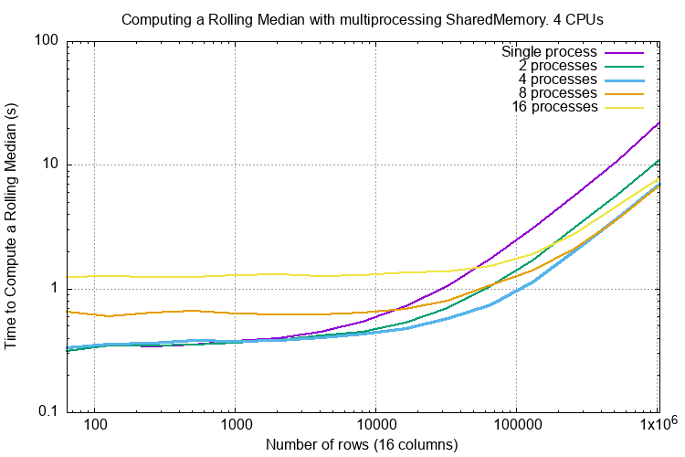
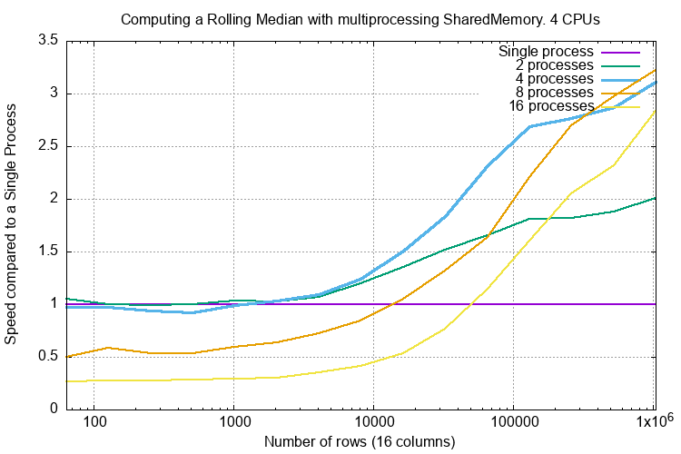

.. highlight:: python
    :linenothreshold: 10

.. highlight:: c
    :linenothreshold: 10

.. toctree::
    :maxdepth: 2

.. _skiplist-rolling-median-label:

===============================================
Computing a Rolling Median
===============================================

Rolling Median in C++
-----------------------------------------

A powerful use case for a skip list is in the computation of a rolling fraction, for example a rolling median.

Here is a reasonable C++ attempt at doing that with the arguments:

* ``data`` - A vector of data of type ``T``.
* ``win_length`` - a 'window' size. The median is computed over this number of values.
* ``result`` - a destination vector for the result. This will end up with ``count - win_length`` values.

Rolling median code using a skip list might look like this, error checking is omitted:

.. code-block:: cpp

    #include "SkipList.h"
    
    template <typename T>
    void rolling_median(const std::vector<T> data,
                        size_t win_length,
                        std::vector<T> &result) {
        
        OrderedStructs::SkipList::HeadNode<T> sl;

        result.clear();
        for (size_t i = 0; i < data.size(); ++i) {
            sl.insert(data[i]);
            if (i  >= win_length) {
                result.push_back(sl.at(win_length / 2));
                sl.remove(data[i - win_length]);
            }
        }
    }

If you are working with C arrays (such as Numpy arrays) then this C'ish approach might be better, again error checking omitted:

.. code-block:: c

    #include "SkipList.h"
    
    template <typename T>
    void rolling_median(const T *src, size_t count, size_t win_length, T *dest) {
        
        OrderedStructs::SkipList::HeadNode<T> sl;
        const T *tail = src;

        for (size_t i = 0; i < count; ++i) {
            sl.insert(*src);
            if (i + 1 >= win_length) {
                *dest = sl.at(win_length / 2);
                ++dest;
                sl.remove(*tail);
                ++tail;
            }
            ++src;
        }
    }

Multidimensional Numpy arrays have a stride value which is omitted in the above code but is simple to add. See *RollingMedian.h* and *test/test_rolling_median.cpp* for further examples.

Rolling percentiles require a argument that says what fraction of the window the required value lies. Again, this is easy to add.

Even Window Length
^^^^^^^^^^^^^^^^^^^^^^^^^^^^^

The above code assumes that if the window length is even that the median is at ``(window length - 1) / 2``. A more plausible median for even sized window lengths is the mean of ``(window length - 1) / 2`` and ``window length / 2``. This requires that the mean of two types is meaningful which it will not be for strings.

Rolling Median in Python
----------------------------------------

Here is an example of computing a rolling median of a ``numpy`` 1D array:

.. code-block:: python

    import numpy as np

    import orderedstructs

    def simple_python_rolling_median(vector: np.ndarray,
                                     window_length: int) -> np.ndarray:
        """Computes a rolling median of a numpy vector returning a new numpy
        vector of the same length.
        NaNs in the input are not handled but a ValueError will be raised."""
        if vector.ndim != 1:
            raise ValueError(
                f'vector must be one dimensional not shape {vector.shape}'
            )
        skip_list = orderedstructs.SkipList(float)
        ret = np.empty_like(vector)
        for i in range(len(vector)):
            value = vector[i]
            skip_list.insert(value)
            if i >= window_length - 1:
                # // 4 for lower quartile
                # * 3 // 4 for upper quartile etc.
                median = skip_list.at(window_length // 2)
                skip_list.remove(vector[i - window_length + 1])
            else:
                median = np.nan
            ret[i] = median
        return ret

This can be called thus:

.. code-block:: python

    np_array = np.arange(10.0)
    print('Original:', np_array)
    result = simple_python_rolling_median(np_array, 3)
    print('  Result:', result)

And the result will be:

.. code-block:: text

    Original: [0. 1. 2. 3. 4. 5. 6. 7. 8. 9.]
      Result: [nan nan  1.  2.  3.  4.  5.  6.  7.  8.]

.. _rolling-median-mp-shared-memory-label:

Rolling Median in Python with ``multiprocessing.shared_memory``
----------------------------------------------------------------

An exiting development in Python 3.8+ is `multiprocessing.shared_memory <https://docs.python.org/3/library/multiprocessing.shared_memory.html#module-multiprocessing.shared_memory>`_
This allows a parent process to share memory with its child processes.

In this example we are going to compute a rolling median on a 2D numpy array where each child process works on a single column of the same array and writes the result to a shared output array.
There will be two shared memory areas; a read one with the input data and a write one with the result from all the child processes
There will be two corresponding numpy arrays the input that we are given and the output numpy array that we create.

The only copying going on here is the initial copy of the input array into shared memory and then the final copy, when all child processes have completed of *that* shared memory to a single numpy array.

Pictorially:

.. code-block:: text

    Parent                                        Children
    ======                                        ========
    Copies the array to the input SharedMemory
    Creates the output SharedMemory
    Launches n child processes...
    \>>>>>>>>>>>>>>>>>>>>>>>>>>>>>>>>>>>>>>>>>>>>\
                                                  Work on part of the input SharedMemory
                                                  Write to the output SharedMemory
                                                  ...
    /<<<<<<<<<<<<<<<<<<<<<<<<<<<<<<<<<<<<<<<<<<<</
    When all child processes complete...
    Copies output SharedMemory to a new numpy array
    Releases both SharedMemory resources.

Code
^^^^^^

First let's write some code that wraps the low level ``multiprocessing.shared_memory.SharedMemory`` class that can be used by the parent process.
This is a dataclass that records essential information about the array and includes the ``SharedMemory`` object itself.
We will call it an ``SharedMemoryArraySpecification``, it is pretty simple, just a named tuple:

.. code-block:: python

    import multiprocessing
    import typing
    from multiprocessing import shared_memory

    import numpy as np

    import orderedstructs

    class SharedMemoryArraySpecification(typing.NamedTuple):
        shape: typing.Tuple[int, ...]
        dtype: np.dtype
        nbytes: int
        shm: shared_memory.SharedMemory

        @property
        def name(self) -> str:
            return self.shm.name

        def __str__(self):
            return (
                f'<SharedMemoryArraySpecification shape {self.shape} dtype {self.dtype} name "{self.name}"'
                f' nbytes {self.nbytes} buffer id 0x{id(self.shm)}>'
            )

        def close(self) -> None:
            self.shm.close()

        def close_and_unlink(self) -> None:
            self.close()
            self.shm.unlink()

Here is the rolling median function used by the child processes:

.. code-block:: python

    def rolling_median_of_column(read_array: np.ndarray, window_length: int, column_index: int,
                                 write_array: np.ndarray) -> int:
        """Computes a rolling median of given column and writes out the results to the write array.
        Called by a child process."""
        assert read_array.ndim == 2
        assert write_array.ndim == 2
        assert read_array.shape == write_array.shape
        skip_list = orderedstructs.SkipList(float)
        write_count = 0
        for i in range(len(read_array)):
            value = read_array[i, column_index]
            skip_list.insert(value)
            if i >= window_length:
                median = skip_list.at(window_length // 2)
                skip_list.remove(read_array[i - window_length, column_index])
                write_count += 1
            else:
                median = np.nan
            write_array[i, column_index] = median
        return write_count

Now create a function that takes a numpy array, creates the ``SharedMemory`` and returns an ``ArraySpecification``:

.. code-block:: python

    # NOTE: This code used by the parent process.

    def shared_memory_and_array_spec(arr: np.ndarray) -> ArraySpecification:
        """Given a numpy array create a SharedMemory object and encapsulate it in an
        ArraySpecification."""
        shm = shared_memory.SharedMemory(create=True, size=arr.nbytes)
        array_spec = ArraySpecification(arr.shape, arr.dtype, arr.nbytes, shm)
        return array_spec

Now create a context manager that will wrap a numpy array around a ``SharedMemoryArraySpecification``
On exit this automatically releases the reference to the shared memory from the child process.

.. code-block:: python

    @contextlib.contextmanager
    def recover_array_from_shared_memory_and_close(array_spec: SharedMemoryArraySpecification) -> np.ndarray:
        array_shm = shared_memory.SharedMemory(name=array_spec.name)
        array_view = np.ndarray(array_spec.shape, array_spec.dtype, buffer=array_shm.buf)
        try:
            yield array_view
        finally:
            array_shm.close()

And use it in the child process:

.. code-block:: python

    def compute_rolling_median_2d_from_index(read_array_spec: SharedMemoryArraySpecification, window_length: int,
                                             column_index: int,
                                             write_array_spec: SharedMemoryArraySpecification) -> int:
        """Computes a rolling median of the 2D read array and window length and writes it to the 2D write array.
        This is invoked by a child process."""
        with recover_array_from_shared_memory_and_close(read_array_spec) as read_array:
            with recover_array_from_shared_memory_and_close(write_array_spec) as write_array:
                write_count = rolling_median_of_column(read_array, window_length, column_index, write_array)
                return write_count

Create two more context managers, one to copy the input numpy array to shared memory:

.. code-block:: python

    @contextlib.contextmanager
    def create_read_shared_memory_array_spec_close_unlink(arr: np.ndarray) -> SharedMemoryArraySpecification:
        """Context manager that creates a Shared Memory instance and copies the numpy array into it.
        The Shared Memory instance is closed and unlinked on exit."""
        shm = shared_memory.SharedMemory(create=True, size=arr.nbytes)
        array_spec = SharedMemoryArraySpecification(arr.shape, arr.dtype, arr.nbytes, shm)
        logger.info('Created shared memory %s ', array_spec)
        try:
            # Copy the numpy array into shared memory.
            array_view = np.ndarray(array_spec.shape, dtype=array_spec.dtype, buffer=array_spec.shm.buf)
            array_view[:] = arr[:]
            yield array_spec
        finally:
            array_spec.close_and_unlink()

And another to wrap around the output numpy array:

.. code-block:: python

    @contextlib.contextmanager
    def create_write_shared_memory_array_spec_close_unlink(arr: np.ndarray) -> SharedMemoryArraySpecification:
        """Context manager that creates a Shared Memory instance for writing to a numpy array.
        The numpy array can be recovered with copy_shared_memory_into_new_numpy_array().
        The Shared Memory instance is closed and unlinked on exit."""
        shm = shared_memory.SharedMemory(create=True, size=arr.nbytes)
        array_spec = SharedMemoryArraySpecification(arr.shape, arr.dtype, arr.nbytes, shm)
        logger.info('Created shared memory %s ', array_spec)
        try:
            yield array_spec
        finally:
            array_spec.close_and_unlink()

Finally a function to copy the output shared memory to a numpy array:

.. code-block:: python

    def copy_shared_memory_into_new_numpy_array(write_array_spec: SharedMemoryArraySpecification) -> np.ndarray:
        """With the output SharedMemoryArraySpecification this creates a new numpy array and copies the shared memory into it."""
        temp_write = np.ndarray(write_array_spec.shape, dtype=write_array_spec.dtype, buffer=write_array_spec.shm.buf)
        write_array = np.empty(write_array_spec.shape, dtype=write_array_spec.dtype)
        write_array[:] = temp_write[:]
        return write_array

Finally here is the code for the parent process that puts this all together:

.. code-block:: python

    def compute_rolling_median_2d_mp(read_array: np.ndarray, window_length: int, num_processes: int) -> np.ndarray:
        """Compute a rolling median of a numpy 2D array using multiprocessing and shared memory.
        This is run as the parent process."""
        if read_array.ndim != 2:
            raise ValueError(f'Array  must be 2D not {read_array.shape}')
        # Limit number of processes if the number of columns is small.
        if read_array.shape[1] < num_processes:
            num_processes = read_array.shape[1]
        # Create the read and write shared memory context managers
        with create_read_shared_memory_array_spec_close_unlink(read_array) as read_array_spec:
            with create_write_shared_memory_array_spec_close_unlink(read_array) as write_array_spec:
                # Set up the multiprocessing pool.
                mp_pool = multiprocessing.Pool(processes=num_processes)
                tasks = []
                for column_index in range(read_array.shape[1]):
                    tasks.append((read_array_spec, window_length, column_index, write_array_spec))
                # Run compute_rolling_median_2d_from_index() on the pool
                pool_apply = [mp_pool.apply_async(compute_rolling_median_2d_from_index, t) for t in tasks]
                results = [r.get() for r in pool_apply]
                # Extract the result as a numpy array.
                write_array = copy_shared_memory_into_new_numpy_array(write_array_spec)
        return write_array

Performance
^^^^^^^^^^^^

Running this on 16 column arrays with up to 1m rows with processes from 1 to 16 gives the following execution times:

Comparing the **speed** of execution compared to a single process gives:

Clearly there is some overhead so it is not really worth doing this for less that 10,000 columns.
The number of processes equal to the number of CPUs is optimum.

Memory Usage
^^^^^^^^^^^^

.. list-table:: ``multiprocessing.shared_memory`` **Memory Usage**
    :widths: 30 10 10 10 50
    :header-rows: 1

    * - Action
      - Process
      - Process RSS (Mb)
      - Delta RSS (Mb)
      - Notes
    * - Parent start
      - Parent
      - 30
      -
      - Normal Python executable.
    * - Create numpy array
      - Parent
      - 130
      - +100
      - Cost of creating a 100Mb numpy array.
    * - Create read shared memory
      - Parent
      - 225
      - +95
      -
    * - Create write shared memory
      - Parent
      - 225
      - 0
      - No immediate memory hit.
    * - Child start
      - Child
      - 23
      -
      - Normal Python executable.
    * - Rolling median start
      - Child
      - 23
      - +0
      -
    * - Rolling median first quarter completed
      - Child
      - 71
      - +48
      - Writing one quarter of a 100Mb array.
    * - Rolling median half completed
      - Child
      - 119
      - +48
      - Writing another quarter of a 100Mb array.
    * - Rolling median three quarters completed
      - Child
      - 166
      - +47
      - Writing another quarter of a 100Mb array.
    * - Rolling median complete
      - Child
      - 214
      - +48
      - Writing last quarter of a 100Mb array.
    * - Close write shared memory
      - Child
      - 119
      - -95
      -
    * - Close read shared memory
      - Child
      - 23
      - -96
      -
    * - After unlink write array spec.
      - Parent
      - 321
      - +96
      - Children have written to write array.
    * - After unlink read array spec.
      - Parent
      - 226
      - -95
      - Discard read array shared memory.
    * - After unlink read array spec.
      - Parent
      - 35
      - -191
      - Back to standard executable

.. list-table:: ``multiprocessing.shared_memory`` **Memory Usage** Single Process
    :widths: 30 10 10 10 10 50
    :header-rows: 1

    * - Action
      - Parent RSS
      - dRSS
      - Child RSS
      - dRSS
      - Notes
    * - Parent start
      - 30
      - +30
      -
      -
      - Normal Python executable.
    * - Create numpy array
      - 130
      - +100
      - 
      - 
      - Cost of creating a 100Mb numpy array.
    * - Create read shared memory
      - 225
      - +95
      - 
      - 
      - 
    * - Create write shared memory
      - 225
      - 0
      - 
      - 
      - No immediate memory hit.
    * - Child start
      -
      -
      - 23
      -
      - Normal Python executable.
    * - Rolling median start
      -
      -
      - 23
      - +0
      -
    * - Rolling median first quarter completed
      -
      -
      - 71
      - +48
      - Writing one quarter of a 100Mb array.
    * - Rolling median half completed
      -
      -
      - 119
      - +48
      - Writing another quarter of a 100Mb array.
    * - Rolling median three quarters completed
      -
      -
      - 166
      - +47
      - Writing another quarter of a 100Mb array.
    * - Rolling median complete
      -
      -
      - 214
      - +48
      - Writing last quarter of a 100Mb array.
    * - Close write shared memory
      -
      -
      - 119
      - -95
      -
    * - Close read shared memory
      -
      -
      - 23
      - -96
      -
    * - After unlink write array spec.
      - 321
      - +96
      -
      -
      - Children have written to write array.
    * - After unlink read array spec.
      - 226
      - -95
      -
      -
      - Discard read array shared memory.
    * - After unlink read array spec.
      - 35
      - -191
      -
      -
      - Back to standard executable

Here is the breakdown of the RSS memory profile of processing a 6m long two column numpy array (100Mb) with a parent [P] and two child processes [0] and [1]:
The change in RSS is indicated by "∆".

.. list-table:: ``multiprocessing.shared_memory`` Memory Usage With Two Processes
    :widths: 50 10 10 10 10 10 10 50
    :header-rows: 1

    * - Action
      - [P]
      - ∆
      - [0]
      - ∆
      - [1]
      - ∆
      - Notes
    * - Parent start
      - 30
      - +30
      -
      -
      -
      -
      - Normal Python executable.
    * - Create numpy array
      - 130
      - +100
      -
      -
      -
      -
      - Cost of creating a 100Mb numpy array.
    * - Create read shared memory
      - 225
      - +95
      -
      -
      -
      -
      -
    * - Create write shared memory
      - 225
      - 0
      -
      -
      -
      -
      - No immediate memory cost.
    * - Child start
      -
      -
      - 23
      - +23
      - 23
      - +23
      - Normal Python executable.
    * - Rolling median start
      -
      -
      - 23
      - +0
      - 23
      - +0
      -
    * - Rolling median 25%
      -
      -
      - 71
      - +48
      - 71
      - +48
      -
    * - Rolling median 50%
      -
      -
      - 119
      - +48
      - 119
      - +48
      -
    * - Rolling median 75%
      -
      -
      - 166
      - +47
      - 166
      - +47
      -
    * - Rolling median complete
      -
      -
      - 214
      - +48
      - 214
      - +48
      -
    * - Close write shared memory
      -
      -
      - 119
      - -95
      - 119
      - -95
      -
    * - Close read shared memory
      -
      -
      - 23
      - -96
      - 23
      - -96
      -
    * - After unlink write array spec.
      - 321
      - +96
      -
      -
      -
      -
      - Children have written to write array.
    * - After unlink read array spec.
      - 226
      - -95
      -
      -
      -
      -
      - Discard read array shared memory.
    * - All done.
      - 227
      - 0
      -
      -
      -
      -
      - See note below.

.. note::

    There is an interesting quirk here, the array is 6m rows with 2 columns and has a residual memory of 227Mb.
    This is not reduced by a ``gc.collect()``.
    This does not increase if the same function calls are repeated.
    If the array is changed to *16m* rows, 2 columns (260Mb) the residual memory is 35Mb, typical for a minimal Python process.

