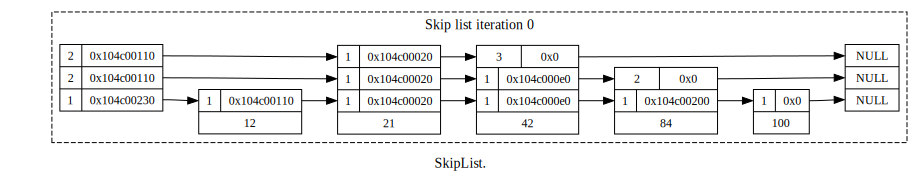
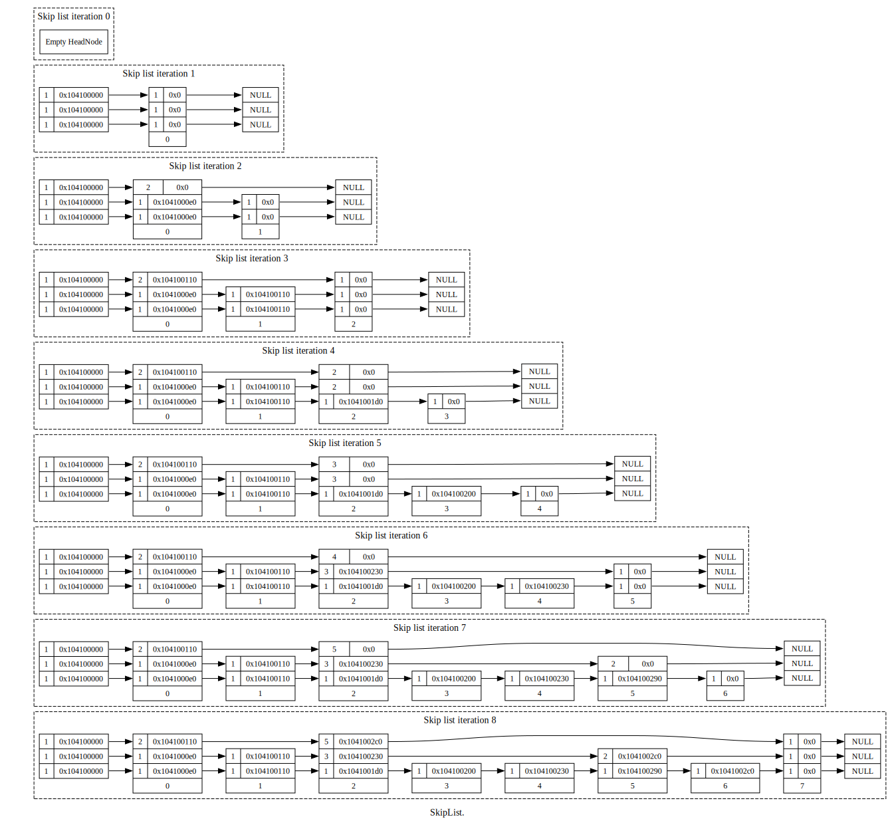
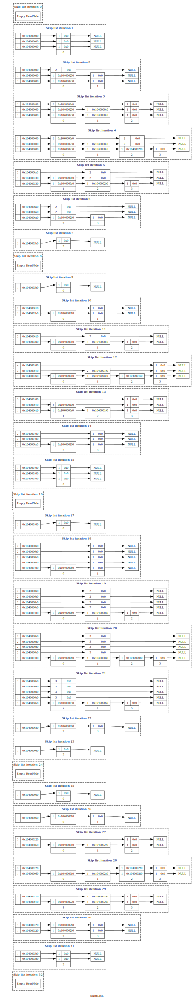

.. highlight:: python
    :linenothreshold: 10

.. highlight:: c
    :linenothreshold: 10

.. toctree::
    :maxdepth: 3

.. _skiplist-visualisation-label:

===============================================
Visualising a Skip List
===============================================

If the skip list is compiled with ``INCLUDE_METHODS_THAT_USE_STREAMS`` defined both the ``HeadNode`` and ``Node`` gain the methods ``dotFile`` and ``dotFileFinalise``.These can be used to write out the current state of the skip list to sdtout in DOT (GraphViz) format. These can be converted to SVG or PNG using dot.

Multiple snapshots of the same skiplist can be taken and plotted in the same graph. Each snapshot is denoted by a number.

=================== ================================================================================
Function            Description
=================== ================================================================================
``dotFile()``       Arguments are: an output stream and a snapshot number (default is 0).
``dotFileFinalise`` Arguments are: an output stream and the number of snapshots.
=================== ================================================================================

----------------------------
Simple Example
----------------------------

This takes a single snapshot of the skip list. Create a skip list and insert 5 values into it. Then call ``dotFile()`` to write out the state of the skip list stdout and ``dotFinalise()`` to complete the graph.

.. code-block:: cpp

    #include "SkipList.h"

    void doc_insert_simple() {
        ManAHL::SkipList::HeadNode<int> sl;
        
        sl.insert(42);
        sl.insert(84);
        sl.insert(21);
        sl.insert(100);
        sl.insert(12);
        
        // Now write the DOT file to stdout as a single snapshot
        sl.dotFile(std::cout, 0);
        sl.dotFileFinalise(std::cout, 1);
    }

Saving stdout to a text file, say *doc_simple.dot* then running this on the command line::

    dot -odoc_simple.svg -Tsvg doc_simple.dot

Will produce something like this SVG diagram:

----------------------------
Inserting the Values 0 to 7
----------------------------

Multiple snapshots can also be created showing how the skiplist grows and shrinks. This diagram was created with the following C++ code:

.. code-block:: cpp

    #include "SkipList.h"

    void doc_insert() {
        int snapshot = 0;
        ManAHL::SkipList::HeadNode<int> sl;
        
        // Write out the empty head node
        sl.dotFile(std::cout, dot_count++);
        // Now insert a value and add the current representation to the DOT file
        for (int i = 0; i < 8; ++i) {
            sl.insert(i);
            sl.dotFile(std::cout, snapshot++);
        }
        // Finalise the dot file with the number of snapshots, this updates internal references
        sl.dotFileFinalise(std::cout, snapshot);
    }

Saving this output to a text file, say *doc_insert.dot* then running this on the command line::

    dot -odoc_insert.svg -Tsvg doc_insert.dot

Will produce this [*doc_insert.svg*]:

.. doc_insert_remove.
.. 
.. .. image:: visualisations/doc_insert_remove.svg
..     :width: 640

---------------------------------------------------------------
Inserting the Values 0 to 3 and Removing them Multiple Times
---------------------------------------------------------------

.. code-block:: cpp

    #include "SkipList.h"

    void doc_insert_remove_repeat() {
        int NUM = 4;
        int REPEAT_COUNT = 4;
        int dot_count = 0;
    
        ManAHL::SkipList::HeadNode<int> sl;

        sl.dotFile(std::cout, dot_count++);
        for (int c = 0; c < REPEAT_COUNT; ++c) {
            for (int i = 0; i < NUM; ++i) {
                sl.insert(i);
                sl.dotFile(std::cout, dot_count++);
            }
            for (int i = 0; i < NUM; ++i) {
                sl.remove(i);
                sl.dotFile(std::cout, dot_count++);
            }
        }
        sl.dotFileFinalise(std::cout, dot_count);
    }

Produces this image, note how the shape of the skip list nodes changes with repeated inserts.

