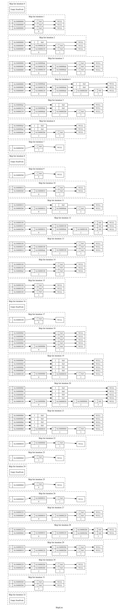

.. highlight:: python
    :linenothreshold: 10

.. highlight:: c
    :linenothreshold: 10

.. toctree::
    :maxdepth: 3

.. _skiplist-visualisation-label:

===============================================
Visualising a Skip List
===============================================

If the skip list is compiled with ``INCLUDE_METHODS_THAT_USE_STREAMS`` defined both the ``HeadNode`` and ``Node`` gain the methods ``dotFile`` and ``dotFileFinalise``.
These can be used to write out the current state of the skip list to sdtout in DOT (GraphViz) format. These can be converted to SVG or PNG using dot.

Multiple snapshots of the same skiplist can be taken and plotted in the same graph. Each snapshot is denoted by a number.

===================== ==============================================================================
Function              Description
===================== ==============================================================================
``dotFile()``         Arguments are: an output stream.
``dotFileFinalise()`` Arguments are: an output stream.
===================== ==============================================================================

----------------------------
Simple Example in C++
----------------------------

This takes a single snapshot of the skip list. Create a skip list and insert 5 values into it.
Then call ``dotFile()`` to write out the state of the skip list stdout and ``dotFinalise()`` to complete the graph.

.. code-block:: cpp

    #include "SkipList.h"

    void doc_insert_simple() {
        OrderedStructs::SkipList::HeadNode<int> sl;

        sl.insert(42);
        sl.insert(84);
        sl.insert(21);
        sl.insert(100);
        sl.insert(12);

        sl.dotFile(std::cout);
        sl.dotFileFinalise(std::cout);
    }

Saving ``stdout`` to a text file, say *doc_simple.dot* then running this on the command line:

.. code-block:: bash

    dot -odoc_simple.png -Tpng doc_simple.dot

Will produce something like this SVG diagram:

Inserting the Values 0 to 7
----------------------------

Multiple snapshots can also be created showing how the skiplist grows and shrinks.
This diagram was created with the following C++ code:

.. code-block:: cpp

    #include "SkipList.h"

    void doc_insert() {
        OrderedStructs::SkipList::HeadNode<int> sl;
        
        // Write out the empty head node
        sl.dotFile(std::cout);
        // Now insert a value and add the current representation to the DOT file
        for (int i = 0; i < 8; ++i) {
            sl.insert(i);
            sl.dotFile(std::cout);
        }
        // Finalise the dot file with the number of snapshots, this updates internal references
        sl.dotFileFinalise(std::cout);
    }

Saving this output to a text file, say *doc_insert.dot* then running this on the command line::

    dot -odoc_insert.png -Tpng doc_insert.dot

Will produce this [*doc_insert.png*]:

.. image:: visualisations/doc_insert.png
    :width: 800

.. doc_insert_remove.
.. 
.. .. image:: visualisations/doc_insert_remove.png
..     :width: 640

Inserting the Values 0 to 3 and Removing them Multiple Times
---------------------------------------------------------------

This visualisation is produced by this code:

.. code-block:: cpp

    #include "SkipList.h"

    void doc_insert_remove_repeat() {
        int NUM = 4;
        int REPEAT_COUNT = 4;
    
        OrderedStructs::SkipList::HeadNode<int> sl;

        sl.dotFile(std::cout);
        for (int c = 0; c < REPEAT_COUNT; ++c) {
            for (int i = 0; i < NUM; ++i) {
                sl.insert(i);
                sl.dotFile(std::cout);
            }
            for (int i = 0; i < NUM; ++i) {
                sl.remove(i);
                sl.dotFile(std::cout);
            }
        }
        sl.dotFileFinalise(std::cout);
    }

Produces this image, note how the shape of the skip list nodes changes with repeated inserts.

----------------------------
Simple Example in Python
----------------------------

The Python interface is via a single function ``.dot_file()`` that returns a bytes object that is suitable for saving as a .dot file.

.. code-block:: python

    import cSkipList

    sl = cSkipList.PySkipList(float)

    sl.insert(42.0)
    sl.insert(21.0)
    sl.insert(84.0)

    dot_bytes = sl.dot_file()

    with open('doc_simple_py.dot', 'w') as dot_file:
        dot_file.write(dot_bytes.decode('ascii'))

*doc_simple_py.dot* will look something like:

.. code-block:: text

    digraph SkipList {
    label = "SkipList."
    graph [rankdir = "LR"];
    node [fontsize = "12" shape = "ellipse"];
    edge [];

    subgraph cluster0 {
    style=dashed
    label="Skip list iteration 0"

    "HeadNode0" [
    label = "{ 1 | <f2> 0x7f8a68d86280} | { 1 | <f1> 0x7f8a68d86280}"
    shape = "record"
    ];
    "HeadNode0":f1 -> "node00x7f8a68d86280":w1 [];
    "HeadNode0":f2 -> "node00x7f8a68d86280":w2 [];

    "node00x7f8a68d86280" [
    label = " { <w2> 2 | <f2> 0x7f8a68d9dcc0 } | { <w1> 1 | <f1> 0x7f8a68d44ec0 } | <f0> 21"
    shape = "record"
    ];
    "node00x7f8a68d86280":f1 -> "node00x7f8a68d44ec0":w1 [];
    "node00x7f8a68d86280":f2 -> "node00x7f8a68d9dcc0":w2 [];
    "node00x7f8a68d44ec0" [
    label = " { <w1> 1 | <f1> 0x7f8a68d9dcc0 } | <f0> 42"
    shape = "record"
    ];
    "node00x7f8a68d44ec0":f1 -> "node00x7f8a68d9dcc0":w1 [];
    "node00x7f8a68d9dcc0" [
    label = " { <w2> 1 | <f2> 0x0 } | { <w1> 1 | <f1> 0x0 } | <f0> 84"
    shape = "record"
    ];
    "node00x7f8a68d9dcc0":f1 -> "node00x0":w1 [];
    "node00x7f8a68d9dcc0":f2 -> "node00x0":w2 [];

    "node00x0" [label = "<w2> NULL | <w1> NULL" shape = "record"];
    }

    node0 [shape=record, label = "<f0> | ", style=invis, width=0.01];
    node0:f0 -> HeadNode0 [style=invis];
    }

Running:

.. code-block:: bash

    dot -odoc_simple_py.png -Tpng doc_simple_py.dot

Will produce something like this:

